# Edge Platform™ Architecture Specification (EPAS)

**Version 2.0 – Publication Draft / Source of Truth**  
**Repository:** `Gablenook/EPAS`  
**Document:** `EdgePlatformArchitectureSpecification-v2.0-publication-draft.md`  
**Status:** Consolidated publication draft / authoritative source-of-truth candidate  
**Revision Date:** 2026-07-03

> EPAS defines the Toren Edge Platform architecture: the durable engineering foundation for governed physical-edge systems such as asset custody kiosks, field-deployed device exchange systems, package exchange systems, controlled-access equipment systems, and other transaction-controlled edge operations.

---

## Document Control

This document is the authoritative master manuscript for the Edge Platform Architecture Specification. It should be updated directly as the platform architecture matures. Separate slide decks, executive briefs, legal summaries, patent working notes, implementation tickets, customer proposals, and training materials may derive from this manuscript, but they should not replace it.

### Revision History

| Version | Date | Description |
| --- | --- | --- |
| 1.0 | 2026-07-02 | Master manuscript established as the authoritative EPAS architecture specification. |
| 1.1 | 2026-07-03 | Began structured manuscript edit: strengthened document governance, platform thesis, standard chapter pattern, responsibility boundaries, and implementation-alignment language. |
| 1.2 | 2026-07-03 | Aligned manuscript naming around Toren ownership, EPAS as the platform reference architecture, and generic licensed product/deployment language. |
| 1.3 | 2026-07-03 | Expanded Chapter 1 to define the platform vision, problem addressed, commercial hierarchy, operating domain, naming independence, and chapter boundary. |
| 1.4 | 2026-07-03 | Expanded Chapter 2 to define governing architectural principles, principle application rules, and platform-level decision tests. |
| 1.5 | 2026-07-03 | Expanded Chapter 3 to define the Platform Technology taxonomy, qualification criteria, collaboration model, ownership boundaries, and chapter-control role. |
| 1.6 | 2026-07-03 | Expanded Chapter 4 to define Commissioning Technology responsibilities, data ownership, operational model, failure modes, audit requirements, and platform significance. |
| 1.7 | 2026-07-03 | Expanded Chapter 5 to define Configurable Workflow Engine responsibilities, workflow schema, execution model, versioning, failure modes, audit requirements, and platform significance. |
| 1.8 | 2026-07-03 | Expanded Chapter 6 to define Runtime Orchestration responsibilities, transaction lifecycle, coordination model, failure modes, audit requirements, ACK/reconciliation path, and platform significance. |
| 2.0 | 2026-07-03 | Consolidated Version 1.8 master baseline through Chapter 6 with expanded Chapters 7–19 and Appendices A–F into one publication-draft source file. |

### Editing Rule

After Version 2.0 consolidation, this publication draft is the source-of-truth candidate for the Specification. Downstream documents, PDFs, Canva designs, executive briefs, legal summaries, implementation tickets, customer proposals, and training materials should be regenerated, revised, or cross-checked against this file.

### Naming and Ownership Rule

Toren is the company, platform owner, and licensor. EPAS is the reference architecture for the Toren Edge Platform. Products, customer systems, licensee implementations, manufactured locker systems, and branded deployments may implement or express the platform, but they do not define the architecture. The master manuscript should therefore avoid tying EPAS to any single product name, customer name, manufacturer, or licensee unless that reference is deliberately required for implementation evidence or commercial context.

---

## Contents

- Executive Summary
- List of Figures
- Part I — Platform Foundation
  - Chapter 1 — Platform Vision
  - Chapter 2 — Architectural Principles
  - Chapter 3 — Platform Technology Architecture
  - Chapter 4 — Commissioning Technology
  - Chapter 5 — Configurable Workflow Engine
  - Chapter 6 — Runtime Orchestration
- Part II — Operational Trust and Custody
  - Chapter 7 — Custody Governance
  - Chapter 8 — Transaction Integrity
  - Chapter 9 — Hardware Abstraction
  - Chapter 10 — Local Persistence
  - Chapter 11 — Backend Integration
- Part III — Platform Operations
  - Chapter 12 — Cross-Cutting Services
  - Chapter 13 — Security Architecture
  - Chapter 14 — Administrative Services
  - Chapter 15 — Deployment Architecture
  - Chapter 16 — Commercial Architecture
- Part IV — Strategic Direction
  - Chapter 17 — Future Platform Evolution
  - Chapter 18 — Intellectual Property Strategy
  - Chapter 19 — Conclusions and Strategic Vision
- Appendix A — Platform Technology Responsibility Matrix
- Appendix B — Core Architectural Principles
- Appendix C — Glossary
- Appendix D — Figure Production Notes
- Appendix E — Chapter Specification Pattern
- Appendix F — Implementation Evidence Register

---

## Executive Summary

The Toren Edge Platform is a software and systems architecture for controlling trusted physical transactions at the operational edge. It exists for environments where enterprise systems, local devices, human operators, physical compartments, credentials, scanners, relays, doors, sensors, and audit trails must work together as one governed system.

EPAS captures the architectural foundation that allows one platform to support package pickup, asset checkout, device staging, custody transfer, equipment exchange, inventory-controlled access, and future edge workflows without rewriting the core system for each customer. The first commercial deployments may include locker-based custody, package exchange, device checkout, equipment staging, and other controlled-access applications, but those deployments are licensed or configured expressions of the Toren Edge Platform rather than the architectural boundary of EPAS.

The platform is built around a simple but powerful division of responsibility:

- Enterprise systems define business authority.
- The edge platform executes physical operations.
- Local runtime services preserve continuity when connectivity is imperfect.
- Transaction journals protect operational truth.
- Configuration expresses deployment variation.
- Hardware adapters isolate device-specific behavior.
- Audit and reconciliation make every important action explainable.

The central claim of EPAS is that edge systems should not be treated as thin user interfaces attached to cloud software. Physical edge execution has its own responsibilities. Doors open locally. Credentials are scanned locally. Relays fire locally. Compartments become occupied or vacant locally. Operators need immediate feedback locally. When the network is slow, interrupted, or unavailable, the platform must still preserve an accurate account of what happened.

EPAS therefore describes a platform-first architecture rather than a single-purpose application. It establishes the rules, technologies, boundaries, and responsibilities needed to build repeatable edge products from a common foundation. The visual structure of this argument is introduced in **Figure 1** and expanded through the remaining figures.

### Executive Thesis

The Toren Edge Platform creates commercial and technical leverage by converting one-off physical-edge applications into governed, configurable, recoverable, hardware-adaptable platform deployments. Its value is not merely that it opens a locker or validates an asset. Its value is that it defines a repeatable pattern for connecting business authority to local physical execution while preserving operational truth.

This thesis has four consequences:

1. **The platform must own edge execution.** Backend systems may authorize and record business state, but the local platform must own the truth of physical events it performs.
2. **The platform must be configurable before it is customized.** Customer-specific workflows should be expressed through workflow definitions, validation profiles, and policy configuration whenever practical.
3. **The platform must remain recoverable.** Every critical physical transaction must have a durable journal, terminal state, or reconciliation path.
4. **The platform must become commercially reusable.** Each deployment should improve the common platform rather than create another isolated custom solution.

---

## List of Figures

| Figure | Title | Primary Location | Purpose |
| --- | --- | --- | --- |
| Figure 1 | Edge Platform Context Model | Executive Summary / Chapter 1 | Shows the relationship between enterprise authority, edge execution, operators, hardware, and audit evidence. |
| Figure 2 | Platform / Product / Deployment Hierarchy | Chapter 1 | Explains why EPAS governs the Toren Edge Platform while products and customer installations are licensed or configured expressions of the platform. |
| Figure 3 | Platform Technology Map | Chapter 3 | Organizes the major Platform Technologies and their boundaries. |
| Figure 4 | Commissioning Flow | Chapter 4 | Shows how a generic edge node becomes a site-specific operating system. |
| Figure 5 | Configurable Workflow Model | Chapter 5 | Shows how workflow configuration drives customer-specific behavior without code forks. |
| Figure 6 | Runtime Transaction Lifecycle | Chapter 6 | Shows a transaction from initiation through acknowledgement and reconciliation. |
| Figure 7 | Custody State Model | Chapter 7 | Shows movement among available, reserved, staged, occupied, checked out, returned, defective, and reconciliation states. |
| Figure 8 | Transaction Journal and Recovery Model | Chapter 8 | Shows how incomplete transactions are detected, recovered, acknowledged, or reconciled. |
| Figure 9 | Hardware Abstraction Layer | Chapter 9 | Shows platform logic separated from scanners, readers, relay controllers, sensors, and future hardware. |
| Figure 10 | Local Persistence Model | Chapter 10 | Shows configuration, locker status, journal, audit, diagnostics, and reconciliation queues. |
| Figure 11 | Edge-to-Backend Responsibility Split | Chapter 11 | Shows which responsibilities belong to the enterprise backend and which belong to edge execution. |
| Figure 12 | Cross-Cutting Services Fabric | Chapter 12 | Shows logging, tracing, health, diagnostics, retry policy, and correlation across the platform. |
| Figure 13 | Security Trust Boundary Model | Chapter 13 | Shows actor identity, kiosk identity, backend identity, administrative access, and protected local configuration. |
| Figure 14 | Administrative Operations Model | Chapter 14 | Shows governed support actions, diagnostics, recovery, and overrides. |
| Figure 15 | Deployment Package Model | Chapter 15 | Shows operating system, application runtime, hardware drivers, configuration, database, and support artifacts. |
| Figure 16 | Commercial Reuse Flywheel | Chapter 16 | Shows how platform-first engineering reduces deployment cost and compounds product value. |
| Figure 17 | Platform Evolution Roadmap | Chapter 17 | Shows future Platform Technologies and extension points. |
| Figure 18 | IP Strategy Map | Chapter 18 | Shows how vocabulary, architecture, implementation, and evidence support defensible intellectual property. |
| Figure 19 | EPAS Strategic Summary | Chapter 19 | Summarizes the full platform argument in one executive graphic. |

---

## Figure 1 — Edge Platform Context Model

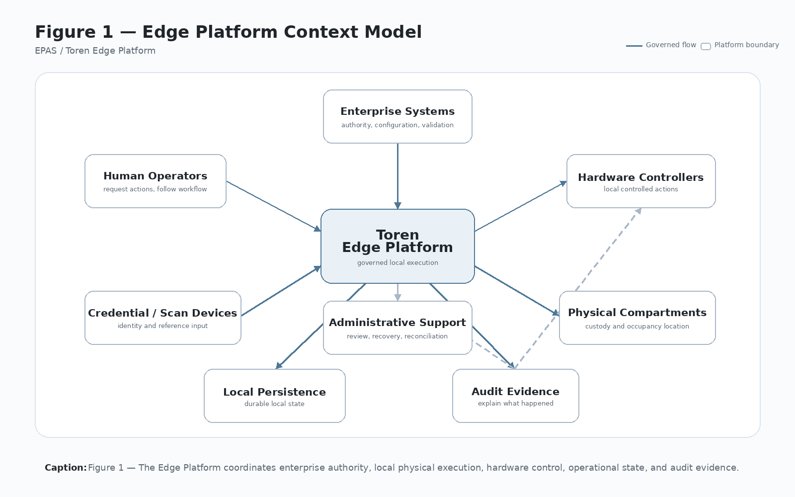

**Caption:** Figure 1 — The Edge Platform coordinates enterprise authority, local physical execution, hardware control, operational state, and audit evidence.

---

# Part I — Platform Foundation

# Chapter 1 — Platform Vision

## 1.1 Purpose

The Toren Edge Platform exists to make physical operations trustworthy, repeatable, configurable, and commercially reusable. It is intended for systems where software is responsible for authorizing, controlling, recording, and reconciling physical actions. **Figure 1** shows the broad operating context in which EPAS applies.

The platform is not limited to one product, cabinet type, locker manufacturer, customer deployment, or workflow family. It is a reusable architecture for connecting business authority to local physical execution while preserving a durable account of what happened at the edge.

Examples include:

- A worker checking out a serialized device.
- A technician staging equipment into a controlled compartment.
- A customer retrieving a package.
- A government user accessing controlled equipment.
- A field employee returning a defective asset.
- A site administrator reconciling local physical state with enterprise records.

In each case, the system must answer four questions with confidence:

1. Who performed the action?
2. What object or asset was involved?
3. What physical compartment, device, or custody location was used?
4. What evidence proves the transaction occurred?

## 1.2 Problem Addressed

Many physical-edge systems begin as single-purpose applications. A screen is built for one workflow, a relay board is wired for one device, a backend call is shaped around one customer, and local storage is added only when a problem appears in the field. That approach may produce a working installation, but it does not automatically produce a repeatable platform.

EPAS addresses the gap between a functioning edge product and a governed edge platform. It defines the architecture needed when local devices, physical compartments, credentials, backend authority, operators, administrators, audit records, and recovery paths must behave as one system.

The central problem is not simply opening a compartment. The central problem is preserving operational truth when a physical action occurs under software control. Once a door opens, a relay fires, a credential is accepted, or an asset is placed into custody, the edge system must be able to explain what happened even if the network fails, the operator leaves, the backend rejects a later acknowledgement, or a support technician must recover the transaction.

## 1.3 Platform, Product, Licensee, and Deployment

EPAS distinguishes between four levels of design and commercialization:

- **Platform:** The durable Toren-owned architecture, runtime services, transaction model, workflow model, hardware abstraction, persistence model, security model, and integration patterns.
- **Product:** A packaged or branded expression of the platform.
- **Licensee:** A company or business entity authorized to implement, commercialize, manufacture, sell, operate, or distribute a product or deployment based on EPAS.
- **Deployment:** A configured instance of a product or licensed implementation for a customer, site, workflow, hardware set, and operating policy.

This distinction is fundamental. Product features should strengthen the platform whenever possible. Deployment-specific behavior should be expressed through configuration rather than source-code forks. Licensee, manufacturer, customer, or product-specific language should not be allowed to redefine the platform architecture.

The practical consequence is that EPAS must be written from the platform downward:

1. Toren owns and evolves the platform architecture.
2. EPAS defines the reference architecture and vocabulary.
3. Products package the platform for markets and use cases.
4. Licensees or commercial partners may manufacture, sell, operate, or distribute platform-based products.
5. Deployments configure the product for a specific customer, site, workflow, and hardware environment.
6. Field learning from deployments should feed back into the platform rather than remain trapped as isolated customization.

**Figure 2** should be used whenever EPAS is explained to a business, engineering, legal, investor, or partner audience because it prevents confusion between the platform, the product, the licensee, and any one customer installation.

## Figure 2 — Platform / Product / Deployment Hierarchy

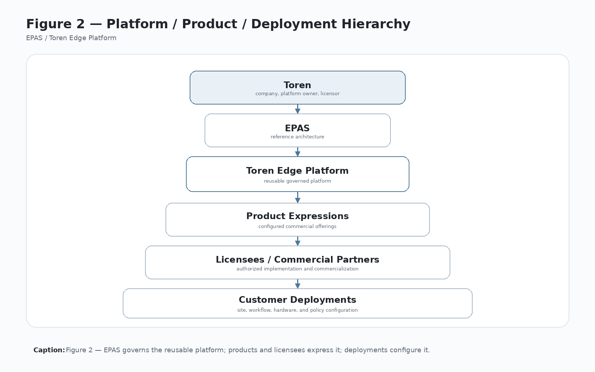

**Caption:** Figure 2 — EPAS governs the reusable Toren Edge Platform; products and licensees express the platform; deployments configure products for specific customers and sites.

## 1.4 Architectural Goal

The architectural goal is not merely to open lockers. The goal is to create a governed edge execution environment where physical action, business authorization, local state, backend state, and audit evidence remain aligned.

The platform must be:

- **Deterministic:** The same inputs should produce the same platform behavior.
- **Recoverable:** Interrupted transactions must be visible and reconcilable.
- **Configurable:** Different workflows must be supported without architectural rewrites.
- **Auditable:** Every important action must produce durable evidence.
- **Hardware-independent:** The platform must support different scanners, readers, controllers, sensors, compartments, and future physical-control technologies.
- **Commercially reusable:** Each customer deployment should improve the platform rather than create isolated custom code.
- **Licensable:** The architecture should be clear enough that products, licensees, and partners can implement it without redefining it.
- **Defensible:** The vocabulary, boundaries, and implementation evidence should support Toren's commercial and intellectual-property position.

## 1.5 Operating Domain

EPAS applies where software governs a physical action that has business, custody, audit, or security meaning. The platform is most valuable when all of the following conditions exist:

- A human, system, or service actor requests an action.
- A credential, reference, asset, package, work order, device, or custody object must be validated.
- A physical device or compartment must be controlled locally.
- Local state must remain meaningful even when enterprise connectivity is imperfect.
- Backend systems must receive acknowledgement or reconciliation evidence.
- Administrative recovery must be possible without bypassing governance.

This domain includes locker-based custody, controlled equipment access, serialized device exchange, package movement, field asset staging, inventory-controlled release, return workflows, defect workflows, and other governed physical-edge transactions.

## 1.6 Product Naming and Brand Independence

EPAS intentionally separates platform language from product, customer, manufacturer, and licensee names. Toren is the platform owner and licensor. EPAS is the platform reference architecture. Products, licensees, manufacturers, customer-specific kiosks, and future branded systems may all express the platform, but they should not define the architecture.

A product name may carry market identity, but the platform vocabulary carries engineering, commercial, licensing, and intellectual-property continuity.

For that reason, the master manuscript should avoid product-specific naming unless the reference is needed for implementation evidence, licensee context, customer history, or legal/commercial analysis. Even then, product-specific references should be framed as examples of platform expression rather than definitions of platform scope.

## 1.7 Chapter Boundary

Chapter 1 owns the platform vision and the distinction among Toren, EPAS, the Edge Platform, products, licensees, and deployments. It does not define the detailed responsibilities of each Platform Technology. Those responsibilities begin in Chapter 3 and are expanded in the individual Platform Technology chapters.

Chapter 1 should therefore remain stable as the commercial and architectural framing chapter. When later chapters add technical detail, they should reinforce this platform-first framing rather than redefine it.

---

# Chapter 2 — Architectural Principles

## 2.1 Purpose

The Edge Platform is governed by a small set of architectural principles that remain constant regardless of programming language, operating system, deployment model, hardware platform, licensee, customer, or product expression. These principles preserve architectural integrity as the platform evolves.

Chapter 2 defines the decision rules used to evaluate platform design, implementation changes, product extensions, customer-specific requests, licensee implementations, and future technical roadmap items. A proposed feature may be useful, but it should not be treated as platform architecture unless it can satisfy these principles.

## 2.2 How the Principles Are Used

The principles in this chapter are not abstract preferences. They are working constraints for engineering, commercialization, support, implementation, and intellectual-property development.

They should be used to answer questions such as:

- Does this capability belong in the reusable platform or in one product deployment?
- Which Platform Technology owns the responsibility?
- Is the behavior configured or hardcoded?
- Is the physical action connected to an explicit transaction context?
- Can the system recover and explain what happened after interruption?
- Are backend assumptions explicit in the API contract?
- Does the implementation strengthen Toren's platform position or create isolated custom work?

When a design decision conflicts with one of these principles, the conflict should be documented as an architectural exception rather than hidden inside implementation code.

## 2.3 Principle 1 — Single Ownership

Every significant engineering responsibility has one architectural owner. Responsibility may be delegated for implementation, but ownership remains singular. This eliminates ambiguity, reduces duplication, and creates a clear place to improve each platform capability.

Examples:

- The workflow engine owns workflow step progression.
- The custody service owns custody-state rules.
- The hardware abstraction layer owns device interaction.
- The transaction journal owns durable transaction recovery.
- Backend integration services own enterprise communication.

Single ownership does not mean isolation. Platform Technologies collaborate, but each collaboration should preserve a clear owner for the decision being made. For example, Runtime Orchestration may coordinate a transaction, but it should not silently become the owner of workflow definition, custody semantics, hardware protocol, backend contract, and audit retention.

Decision test: if two services can independently change the same business meaning, custody rule, hardware command, or recovery state, the design violates single ownership.

## 2.4 Principle 2 — Separation of Responsibilities

Business intent, runtime execution, custody, transaction integrity, hardware control, persistence, enterprise integration, security, administration, deployment, and commercial reuse are intentionally separated into independent Platform Technologies. The separated technology boundaries are summarized visually in **Figure 3**.

This separation prevents the kiosk user interface from becoming the owner of business rules, hardware details, backend contracts, and transaction recovery. The UI presents and collects information. Platform services govern execution.

Separation also protects the platform commercially. When responsibilities are separated, a new product, licensee, customer workflow, controller device, scanner type, or backend system can be added without rewriting the entire application.

Decision test: if a screen, adapter, backend DTO, or customer-specific workflow must know too much about unrelated platform behavior, a responsibility boundary is leaking.

## 2.5 Principle 3 — Configuration Before Customization

Deployments should differ through configuration before source-code customization. Customer-specific behavior should be expressed through workflow definitions, validation profiles, hardware mappings, site settings, and policy configuration whenever practical. **Figure 5** illustrates this principle by separating workflow definition from runtime execution.

This principle makes the platform commercially scalable. It allows one product family to support asset workflows, equipment pickup, package workflows, staging workflows, return workflows, defect workflows, and future custody use cases without fragmenting the codebase.

Configuration should be explicit, versioned, testable, and auditable. A deployment should be able to answer which workflow definition, validation profile, hardware mapping, and policy settings were active when a transaction occurred.

Decision test: if adding a new customer, licensee, workflow label, validation rule, hardware mapping, or operating policy requires source-code branching before configuration has been evaluated, the design should be challenged.

## 2.6 Principle 4 — Deterministic Execution

Identical operational inputs should produce identical architectural behavior. Deterministic execution simplifies diagnostics, testing, certification, recovery, support, and long-term maintenance.

Where external conditions vary, such as backend availability, hardware response timing, operator behavior, or network latency, the platform must preserve deterministic local decisions and durable journal records. **Figure 8** shows how transaction journaling protects deterministic recovery.

Determinism is especially important at the physical edge because a relay command, door opening, credential scan, or custody transition cannot be treated as a reversible user-interface event. The platform should know why it acted and what state resulted.

Decision test: if the same transaction inputs can produce materially different physical or custody outcomes without a documented configuration difference, external failure condition, or explicit exception path, the design is not deterministic enough.

## 2.7 Principle 5 — Operational Trust

The Edge Platform maintains trustworthy operational state even when enterprise connectivity is temporarily unavailable. Enterprise systems coordinate business operations; edge systems execute physical operations. The edge/backend responsibility split is shown in **Figure 11**.

A physical door opening is not theoretical. Once it occurs, the edge system must record it, even if the backend cannot be reached at that moment.

Operational trust requires that the platform can explain:

- who or what initiated the action,
- what was validated or authorized,
- which physical device or compartment was used,
- whether the physical action was attempted or completed,
- what local state changed,
- whether backend acknowledgement succeeded,
- and what recovery or reconciliation path remains open.

Decision test: if support personnel must rely on memory, guesswork, or informal notes to determine whether a physical event occurred, the platform has failed the operational trust principle.

## 2.8 Principle 6 — Platform Before Product

Specific products, licensee systems, customer deployments, and manufactured implementations may express the Toren Edge Platform, but EPAS remains independent of any single product name, manufacturer, customer, or licensee. Engineering investment should strengthen the common platform before adding product-specific capability. This relationship is established in **Figure 2** and extended commercially in **Figure 16**.

Product-specific names, screens, labels, and workflows may vary. The platform responsibilities should remain stable.

This principle protects Toren's commercial position. A product can win a customer; the platform should create reusable capability, licensable architecture, implementation evidence, and future leverage.

Decision test: if a product feature cannot be generalized, configured, reused, licensed, or learned from, it should be treated as deployment-specific work rather than platform architecture.

## 2.9 Principle 7 — No Physical Action Without Transaction Context

Every governed physical action must be connected to an explicit transaction context before the action occurs. The platform should know the actor, workflow, requested action, target compartment, correlation identifiers, and expected acknowledgement path before a relay is commanded or a compartment is opened.

The transaction context is the bridge between business authority and physical execution. It prevents the platform from performing hardware actions that cannot later be explained, acknowledged, audited, or reconciled.

Decision test: if a relay can be fired, a compartment opened, a device released, or a custody state changed without a transaction identifier, actor or credential reference, workflow/action context, and audit path, the design violates this principle.

## 2.10 Principle 8 — Local Truth Must Be Durable

The edge node must preserve a durable account of physical actions because it is the system closest to the physical event. Backend records may later become authoritative for enterprise reporting, but they cannot replace the local record of what physically occurred.

Durable local truth includes transaction journal entries, locker or compartment state, workflow context, hardware action results, timestamps, error records, and acknowledgement/reconciliation status. Local persistence is not merely a cache; it is operational memory for physical events.

Decision test: if power loss, app restart, network failure, or operator abandonment can erase the evidence needed to determine what physical action occurred, the local truth model is insufficient.

## 2.11 Principle 9 — Backend Authority Must Be Explicit

Backend calls must carry explicit identity and context. Silent assumptions about kiosk identity, locker bank identity, workflow key, workflow action, actor identity, request correlation, site identity, tenant identity, or action type create fragile systems.

Backend authority should be visible in contracts. Validation, authorization, acknowledgement, reconciliation, configuration distribution, and audit ingestion should be reviewed for required identity fields and clear ownership of meaning.

Decision test: if the backend must infer which kiosk, locker bank, workflow, actor, customer, or action produced a request from hidden state or naming convention, the contract is not explicit enough.

## 2.12 Principle 10 — Administrative Actions Must Be Governed

Administrative actions are not exceptions to governance. Manual tests, overrides, recoveries, out-of-service changes, configuration reviews, log exports, and reconciliation actions must be permissioned, logged, and explainable.

The platform should support practical field administration, but administrative convenience must not become an untracked bypass around custody, transaction integrity, security, or audit evidence.

Decision test: if an administrator can change physical state, operational state, configuration, transaction status, or reconciliation outcome without permissioning and durable audit evidence, the administrative model is incomplete.

## 2.13 Principle Application Summary

The principles work together as a control system:

- **Single Ownership** and **Separation of Responsibilities** define architectural boundaries.
- **Configuration Before Customization** and **Platform Before Product** protect reuse and commercial scalability.
- **Deterministic Execution**, **No Physical Action Without Transaction Context**, and **Local Truth Must Be Durable** protect physical-edge correctness.
- **Operational Trust**, **Backend Authority Must Be Explicit**, and **Administrative Actions Must Be Governed** protect supportability, auditability, and enterprise confidence.

A design that satisfies only one principle may still be weak. For example, a feature may be configurable but not auditable, recoverable but not explicit, or commercially useful but architecturally leaky. Platform capability should be evaluated against the full principle set.

## 2.14 Chapter Boundary

Chapter 2 owns the governing principles used to judge platform decisions. It does not own the detailed Platform Technology taxonomy, which begins in Chapter 3. It does not own custody semantics, transaction states, backend contracts, or security controls except as principle-level requirements. Those details are expanded in the relevant chapters.

When later chapters introduce implementation detail, the detail should be tested against Chapter 2 rather than redefining the principles locally.

---

# Chapter 3 — Platform Technology Architecture

## 3.1 Purpose

Chapter 3 defines the Platform Technology architecture of the Toren Edge Platform. It converts the principles in Chapter 2 into a structured taxonomy of reusable platform responsibilities.

A Platform Technology is not merely a software class, screen, service, database table, hardware device, or customer feature. It is a durable architectural responsibility with a clear owner, stable interfaces, reusable value across deployments, and enough commercial significance to strengthen the Toren platform rather than only solve one local implementation problem.

Chapter 3 therefore acts as the bridge between the platform vision and the detailed Platform Technology chapters that follow.

## 3.2 Problem Addressed

Without a Platform Technology taxonomy, a physical-edge system tends to collapse into a monolithic kiosk application. Screen logic begins to own workflow decisions. Hardware adapters begin to imply business rules. Backend DTOs begin to define custody semantics. Local database tables begin to substitute for architecture. Administrative tools become informal bypasses. Product-specific urgency begins to override platform integrity.

The Platform Technology architecture prevents that collapse by assigning each durable responsibility to an explicit architectural home. It gives engineering, commercial, legal, and implementation teams a shared map for discussing what the platform owns, what products package, what licensees may implement, and what deployments configure.

## Figure 3 — Platform Technology Map

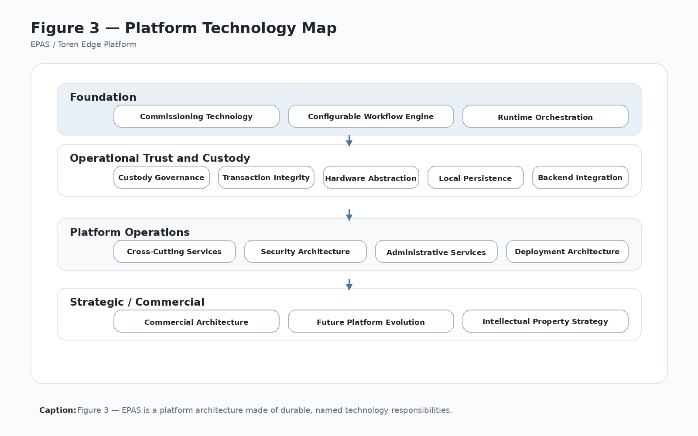

**Caption:** Figure 3 — The Edge Platform is composed of reusable Platform Technologies with explicit ownership, boundaries, collaborators, and commercial significance.

## 3.3 Platform Technology Qualification Criteria

A capability should be treated as a Platform Technology when it satisfies most or all of the following criteria:

- It represents a durable architectural responsibility rather than a temporary implementation detail.
- It is reusable across more than one product, licensee, customer, workflow, hardware configuration, or deployment.
- It has clear ownership and can define what it does not own.
- It exposes stable interfaces or contracts to other parts of the platform.
- It governs important data, state, configuration, identity, transaction, custody, hardware, audit, security, deployment, or commercial meaning.
- It improves supportability, recoverability, repeatability, configurability, licensability, or intellectual-property clarity.
- It can be documented, tested, evolved, and implemented without requiring the entire platform to be rewritten.

A capability should not be elevated to Platform Technology status merely because it is complex, urgent, customer-requested, or difficult to implement. Complexity alone does not make something platform architecture. The test is whether the responsibility should become part of the reusable Toren Edge Platform.

## 3.4 Core Platform Technologies

The first-generation Edge Platform includes the following Platform Technologies:

1. **Commissioning Technology** — Initializes site, kiosk, controller, locker bank, hardware, and local database identity. See **Figure 4**.
2. **Configurable Workflow Engine** — Defines and executes customer workflows through configuration. See **Figure 5**.
3. **Runtime Orchestration** — Coordinates credential scan, reference scan, validation, authorization, compartment assignment, hardware action, state update, ACK, and recovery. See **Figure 6**.
4. **Custody Governance** — Governs asset, package, device, compartment, actor, action, and custody-state rules. See **Figure 7**.
5. **Transaction Integrity** — Journals every critical step and supports recovery after interruption. See **Figure 8**.
6. **Hardware Abstraction** — Isolates device-specific behavior behind stable platform interfaces. See **Figure 9**.
7. **Local Persistence** — Maintains local operational state, configuration, transaction records, audit references, and diagnostics. See **Figure 10**.
8. **Backend Integration** — Communicates with enterprise APIs for validation, authorization, acknowledgement, reconciliation, audit ingestion, and configuration distribution. See **Figure 11**.
9. **Cross-Cutting Services** — Provides logging, tracing, correlation IDs, error handling, telemetry, diagnostics, service health, time services, and serialization support. See **Figure 12**.
10. **Security Architecture** — Protects credentials, identities, device permissions, administrative authority, backend trust, and operational boundaries. See **Figure 13**.
11. **Administrative Services** — Enables local support, diagnostics, override workflows, commissioning review, transaction recovery, and reconciliation without bypassing governance. See **Figure 14**.
12. **Deployment Architecture** — Defines how platform software is packaged, configured, installed, upgraded, rolled back, monitored, and supported. See **Figure 15**.
13. **Commercial Architecture** — Converts engineering structure into repeatable deployment value, licensable platform language, defensible IP, product-family leverage, and field-learning reuse. See **Figure 16**.

These technologies are not equal in runtime frequency, but they are equal in architectural importance. A deployment may use Runtime Orchestration every minute and Deployment Architecture only during installation, but both are necessary to make the platform repeatable and supportable.

## 3.5 Technology Boundaries

Each Platform Technology should expose interfaces that are stable enough for other services to depend on, but narrow enough to prevent responsibility leakage.

Examples:

- The workflow engine should not directly manipulate relay boards.
- The hardware abstraction layer should not decide whether an asset may be checked out.
- Backend integration should not own local door-state truth.
- Local persistence should not define the business meaning of every stored value.
- Administrative tools should not bypass custody, security, or transaction integrity.
- Runtime orchestration should coordinate the transaction without absorbing every platform responsibility.

Boundaries are not paperwork. They are how the platform remains reusable. When a boundary leaks, future products, licensees, hardware configurations, and deployments become more expensive because behavior is trapped in the wrong architectural location.

## 3.6 Collaboration Model

Platform Technologies collaborate through explicit contracts, service boundaries, configuration, durable records, events, DTOs, adapters, or operational policies. Collaboration should preserve ownership.

A typical governed transaction illustrates the collaboration model:

1. The **Configurable Workflow Engine** defines the intended workflow and step sequence.
2. **Runtime Orchestration** coordinates the live execution.
3. **Security Architecture** and **Backend Integration** validate identity and authority.
4. **Custody Governance** determines whether the requested custody action is valid.
5. **Hardware Abstraction** commands the physical device or compartment.
6. **Local Persistence** records local operational state.
7. **Transaction Integrity** journals progress and recovery state.
8. **Cross-Cutting Services** provide correlation, logging, diagnostics, and error classification.
9. **Backend Integration** sends acknowledgement or reconciliation evidence.
10. **Administrative Services** support recovery when normal execution cannot complete.

The collaboration model should make it possible to trace a transaction from business intent to physical action to local evidence to backend acknowledgement.

## 3.7 Ownership Model

Each Platform Technology should define:

- what it owns,
- what it must not own,
- what data or state it governs,
- which technologies it collaborates with,
- which contracts it exposes,
- which failures it must handle,
- which configuration it consumes,
- which audit or diagnostic evidence it produces,
- and how it contributes to platform reuse, licensing, supportability, or IP defensibility.

The ownership model is summarized in **Appendix A — Platform Technology Responsibility Matrix** and expanded in each Platform Technology chapter.

## 3.8 Platform Technology Specification Pattern

Each Platform Technology chapter should eventually be expanded using the same specification pattern:

- Purpose.
- Problem addressed.
- Primary responsibilities.
- Boundaries and non-responsibilities.
- Interfaces and collaborators.
- Data ownership.
- Operational model.
- Failure modes.
- Configuration model.
- Security and audit considerations.
- Commercial significance.
- IP significance.
- Related implementation evidence.
- Related figures.

This pattern is also captured in **Appendix E** so the manuscript can be expanded consistently without becoming a loose collection of technical notes.

## 3.9 Platform Technology Evolution

The Platform Technology list should evolve deliberately. New technologies may be added when the platform discovers a reusable responsibility that is not adequately owned by the existing taxonomy.

Candidate future technologies may include remote commissioning, camera evidence, predictive maintenance, plugin management, advanced reconciliation, mobile administration, environmental monitoring, cloud-managed workflow versioning, or AI-assisted diagnostics. These should be evaluated using the qualification criteria in Section 3.3 and the future roadmap in Chapter 17.

A new technology should not be added merely to make the document appear broader. It should be added only when the responsibility has a stable architectural meaning and strengthens the Toren Edge Platform.

## 3.10 Commercial and IP Significance

The Platform Technology taxonomy is commercially significant because it converts implementation work into reusable platform assets. Each technology gives Toren a way to explain, license, defend, support, and extend the platform.

The taxonomy also supports intellectual-property development by creating stable vocabulary around methods, boundaries, implementation evidence, and platform behavior. A product feature can be copied or replaced; a clearly documented platform architecture is harder to reduce to a one-off product description.

## 3.11 Chapter Boundary

Chapter 3 owns the Platform Technology taxonomy, qualification criteria, collaboration model, and ownership model. It does not define the full internal specification of each technology. Chapters 4 through 16 expand the individual technologies.

When later chapters introduce detail, they should preserve the taxonomy established here. If a later chapter discovers a missing technology, the change should be made deliberately in Chapter 3 and Appendix A rather than implied indirectly in the body of another chapter.

---

# Chapter 4 — Commissioning Technology

## 4.1 Purpose

Commissioning Technology converts generic platform software into a site-specific edge node. It establishes the identity, configuration, hardware mapping, locker or compartment topology, controller addressing, local database records, backend registration context, and initial operational state required before governed runtime transactions can occur.

Commissioning is the platform technology that makes a deployed edge node know what it is, where it is, what hardware it controls, which customer or tenant context it belongs to, how it communicates with backend systems, and how it should initialize local operational truth.

## 4.2 Problem Addressed

A physical-edge platform cannot be trustworthy if each field installation depends on informal setup knowledge, hand-edited configuration, undocumented wiring assumptions, or support-person memory. A generic application becomes dangerous when it can open physical compartments without knowing its site identity, locker bank identity, controller branch mapping, compartment inventory, backend endpoint, or initial custody state.

Commissioning Technology addresses this by turning installation setup into a governed platform workflow. It replaces tribal setup labor with a repeatable process that binds software, hardware, site identity, backend authority, local persistence, and audit evidence together before the first live transaction.

## Figure 4 — Commissioning Flow

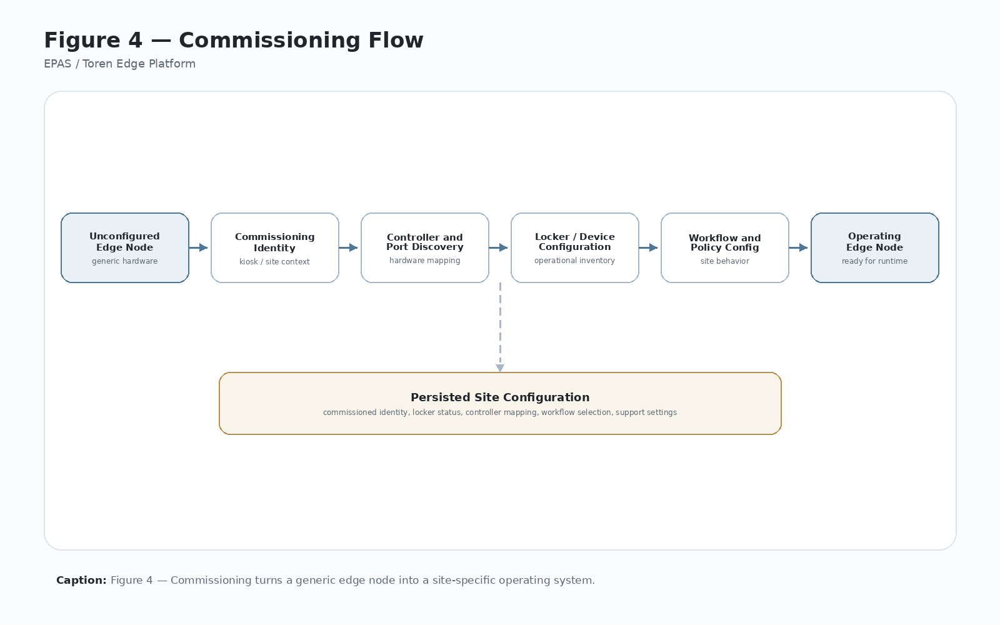

**Caption:** Figure 4 — Commissioning binds a generic platform installation to a specific site, kiosk, locker bank, controller configuration, local operating state, backend context, and audit trail.

## 4.3 Primary Responsibilities

Commissioning Technology owns the controlled process for establishing or confirming:

- Customer, tenant, or licensee context.
- Site or location identity.
- Kiosk or edge-node identity.
- Locker bank, compartment group, or controlled-device identity.
- Controller branch, channel, port, or address mapping.
- Physical compartment inventory, numbering, sizes, zones, and enabled state.
- Scanner, credential-reader, relay-controller, sensor, and peripheral availability.
- Network readiness and backend endpoint settings.
- Local database initialization or migration state.
- Initial locker, compartment, or controlled-device status.
- Security material required for backend communication where applicable.
- Commissioning audit record and diagnostic evidence.

Commissioning must make the resulting configuration explicit enough that Runtime Orchestration, Hardware Abstraction, Local Persistence, Backend Integration, Security Architecture, and Administrative Services can rely on it without guessing.

## 4.4 Boundaries and Non-Responsibilities

Commissioning owns identity binding, initial configuration, hardware mapping, and readiness evidence. It does not own live custody decisions, business authorization, workflow execution, transaction recovery, backend business rules, or long-term operational analytics.

Boundary examples:

- Commissioning may create or confirm a compartment record; Custody Governance defines what custody states mean.
- Commissioning may test a relay path; Hardware Abstraction owns device-specific communication.
- Commissioning may record initial vacant, unavailable, or out-of-service state; Runtime Orchestration and Custody Governance own live transaction changes.
- Commissioning may register a kiosk or edge node with backend services; Backend Integration owns the ongoing API contract.
- Commissioning may capture security material or service identity; Security Architecture owns the trust model and protection requirements.

## 4.5 Interfaces and Collaborators

Commissioning collaborates with several Platform Technologies:

- **Hardware Abstraction** for controller discovery, relay testing, reader testing, scanner testing, door-sensor validation, and peripheral health checks.
- **Local Persistence** for site identity, kiosk identity, locker bank records, compartment records, controller mappings, commissioning state, and audit references.
- **Backend Integration** for backend registration, endpoint validation, configuration sync, and server-side identity confirmation.
- **Security Architecture** for credential handling, device identity, certificates, secrets, administrator authority, and protected configuration.
- **Administrative Services** for commissioning review, correction, recommissioning, diagnostics, and support workflows.
- **Cross-Cutting Services** for logging, correlation IDs, diagnostic export, time services, and error classification.
- **Deployment Architecture** for installer packages, default configuration, local file locations, runtime dependencies, and rollback expectations.

Commissioning should expose its final output as durable, inspectable platform configuration rather than as hidden setup state.

## 4.6 Data Ownership

Commissioning Technology creates or governs the initial values for several important data categories:

- Customer, tenant, licensee, site, and location identifiers.
- Kiosk or edge-node identifiers.
- Locker bank or compartment group identifiers.
- Controller branch, channel, port, address, and hardware mapping records.
- Locker or compartment inventory records.
- Locker size, zone, enabled/disabled, and initial status records.
- Local database initialization and schema readiness markers.
- Backend endpoint and environment references.
- Commissioning status, timestamp, actor, version, and audit records.
- Hardware validation results and diagnostic evidence.

Commissioning owns the creation and initial binding of these records. After commissioning, the operational meaning and live updates of those records are owned by the appropriate Platform Technologies.

## 4.7 Operational Model

A typical commissioning sequence should include:

1. Verify deployment package and runtime readiness.
2. Establish administrative authority for commissioning.
3. Confirm customer, tenant, licensee, site, and location context.
4. Assign or confirm kiosk / edge-node identity.
5. Assign or confirm locker bank or controlled-device group identity.
6. Discover or enter controller branch, channel, port, and address mapping.
7. Generate or import locker, compartment, or controlled-device inventory.
8. Confirm physical numbering, size, zone, and enabled state.
9. Validate scanner, credential reader, relay controller, sensors, and peripherals.
10. Validate network and backend endpoint reachability where required.
11. Create local database records and initial operational state.
12. Register or confirm the edge node with backend services where applicable.
13. Write commissioning audit evidence.
14. Mark the edge node ready, partially ready, failed, or requiring administrative review.

The sequence may be interactive, automated, installer-driven, remotely assisted, or repeated during recommissioning. Regardless of method, the output should be deterministic and auditable.

## 4.8 Failure Modes

Commissioning must anticipate failure because commissioning failures often become field-support failures if they are not captured clearly.

Representative failure modes include:

- Missing or invalid customer, site, kiosk, or locker bank identity.
- Duplicate kiosk or locker bank identity.
- Incorrect controller branch or compartment mapping.
- Relay opens the wrong compartment.
- Scanner, reader, door sensor, controller, or peripheral unavailable.
- Network unavailable during backend registration.
- Backend registration rejects the identity or configuration.
- Local database initialization fails.
- Configuration file missing, corrupt, stale, or incompatible with software version.
- Administrator lacks authority to complete commissioning.
- Partial commissioning leaves the edge node in an unsafe or ambiguous state.

Failure handling should produce visible status, durable diagnostics, and a recovery path. A failed commissioning attempt should not leave the platform pretending it is ready for governed physical transactions.

## 4.9 Configuration Model

Commissioning should distinguish among:

- **Factory or package defaults** supplied by Deployment Architecture.
- **Platform-required identity fields** such as kiosk ID, site ID, and locker bank ID.
- **Customer or licensee configuration** such as tenant context, backend environment, and allowed workflows.
- **Hardware configuration** such as controller branch, relay mapping, sensors, and peripheral assignments.
- **Operational configuration** such as initial compartment state, enabled status, zones, sizes, and administrative settings.
- **Security configuration** such as certificates, secrets, service credentials, administrative permissions, and protected local settings.

Configuration should be explicit, versioned where practical, inspectable by authorized administrators, and exportable for support. Commissioning should not rely on hidden assumptions or untracked manual setup.

## 4.10 Security and Audit Considerations

Commissioning changes the authority and identity of a physical edge node, so it must be governed.

Security and audit requirements include:

- Commissioning should require authorized administrative access.
- Identity assignment and backend registration should be logged.
- Certificate, secret, token, or credential handling should follow Security Architecture rules.
- Hardware validation results should be recorded with enough detail for support review.
- Recommissioning should be distinguishable from initial commissioning.
- Failed or partial commissioning should leave durable evidence.
- Manual corrections should be permissioned and audited.
- Configuration exports should avoid exposing sensitive secrets.

Commissioning evidence is part of operational trust because it proves that the edge node was configured intentionally before physical transactions were allowed.

## 4.11 Commercial Significance

Commissioning Technology is commercially significant because it reduces deployment friction. A platform that can be installed, identified, validated, corrected, and supported through a repeatable process is easier to license, manufacture, deploy, and scale.

Strong commissioning also reduces support cost. Field problems often trace back to misidentified hardware, incorrect compartment mapping, missing backend identity, or unclear local state. Making commissioning a platform technology turns those risks into controlled steps rather than one-off troubleshooting events.

## 4.12 IP Significance

Commissioning Technology contributes to Toren's intellectual-property position by defining a repeatable method for binding a physical edge node to identity, hardware topology, backend context, local persistence, initial custody state, and audit evidence.

The protectable value is not merely a setup screen. The value is the governed commissioning method that converts a generic software/hardware package into a trusted physical-edge execution node.

## 4.13 Related Implementation Evidence

Candidate implementation evidence may include:

- Commissioning screens or administrative workflows.
- Kiosk identity and locker bank identity records.
- Controller branch mapping records.
- Locker or compartment inventory generation logic.
- SQLite schema and seed data for locker and locker-status records.
- Hardware validation logs.
- Backend registration or configuration-sync DTOs.
- Commissioning audit records.
- Deployment configuration files and installer defaults.
- Administrative recommissioning or correction tools.

This evidence should be recorded in Appendix F as implementation matures.

## 4.14 Boundary Rule

Commissioning owns identity binding, hardware topology, local initialization, backend registration context, and readiness evidence. It does not own live custody decisions, transaction execution, transaction recovery, business authorization, or product-specific workflow meaning. Once commissioning is complete, runtime services use the commissioned configuration but remain responsible for live governed transaction behavior.

---

# Chapter 5 — Configurable Workflow Engine

## 5.1 Purpose

The Configurable Workflow Engine allows deployment-specific operational behavior to be expressed through governed configuration rather than source-code customization. It defines the workflow keys, workflow families, workflow actions, ordered steps, labels, prompts, validation profiles, authorization requirements, size-selection policies, exception options, and screen-flow semantics that guide a physical-edge transaction.

The workflow engine is the Platform Technology that turns customer, licensee, product, and deployment variation into controlled configuration while preserving common runtime execution rules.

## 5.2 Problem Addressed

Physical-edge deployments often look different at the user level. One deployment may support package pickup. Another may support serialized device checkout. Another may support equipment staging, return, exchange, defect marking, controlled access, or inventory release. If each variation becomes a source-code branch, the platform fragments quickly.

The Configurable Workflow Engine addresses this by separating configured intent from runtime execution. A deployment can define what workflow is being performed, what inputs are required, what labels should be shown, what validation profile applies, and what action is intended without changing the platform services that validate, authorize, assign compartments, command hardware, update local state, journal transactions, and send acknowledgements.

## Figure 5 — Configurable Workflow Model

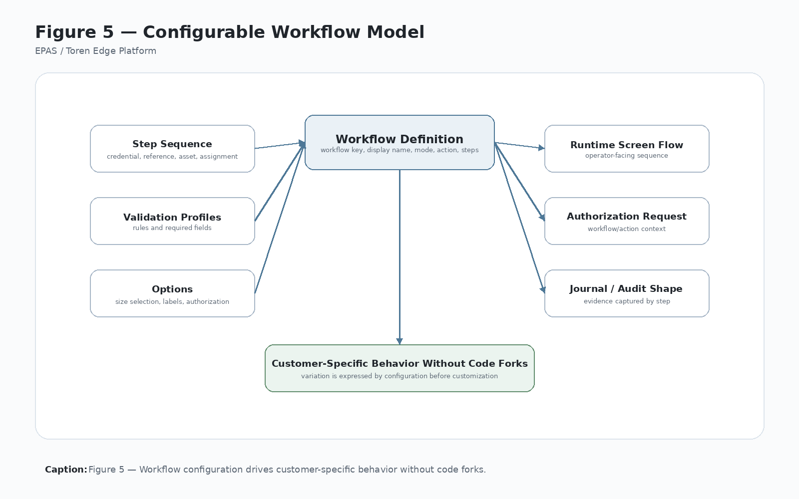

**Caption:** Figure 5 — Workflow configuration expresses deployment-specific behavior while runtime services preserve governed platform execution.

## 5.3 Primary Responsibilities

The Configurable Workflow Engine owns:

- Workflow definition structure.
- Workflow keys and stable workflow identifiers.
- Workflow families or modes.
- Workflow actions such as pickup, stage, checkout, return, exchange, deposit, retrieve, release, or inspect.
- Ordered workflow steps.
- Step requirements and step progression rules.
- User-facing workflow labels and prompts where they are configuration-driven.
- Reference labels and required input types.
- Validation profile selection.
- Authorization requirement flags.
- Size-selection policy.
- Defect, exception, condition, or disposition options where applicable.
- Home-screen or workflow-entry labels.
- Workflow versioning and configuration auditability.
- Rules for determining whether a configured workflow is valid enough for runtime execution.

The workflow engine must define intent clearly enough that Runtime Orchestration can execute the workflow without guessing what business action is being requested.

## 5.4 Boundaries and Non-Responsibilities

The workflow engine owns configured intent and step progression. It does not own hardware implementation, backend business authority, custody-state truth, transaction recovery, security policy, or local persistence mechanics.

Boundary examples:

- The workflow engine may define that a workflow action is `checkout`; Custody Governance determines whether the checkout transition is valid.
- The workflow engine may specify that backend authorization is required; Backend Integration owns the API contract and response handling.
- The workflow engine may define that a compartment size should be selected; Runtime Orchestration and assignment services coordinate the actual selection.
- The workflow engine may define a scanner input step; Hardware Abstraction owns scanner behavior.
- The workflow engine may expose labels and prompts; the UI renders them but should not redefine workflow meaning.
- The workflow engine may identify exception options; Transaction Integrity and Custody Governance preserve the resulting evidence and state transitions.

## 5.5 Interfaces and Collaborators

The Configurable Workflow Engine collaborates with:

- **Runtime Orchestration** to provide the active workflow definition, current step, required inputs, and action semantics.
- **Backend Integration** to select validation profiles, authorization requirements, request context, and acknowledgement meaning.
- **Custody Governance** to connect workflow action to valid custody transitions.
- **Hardware Abstraction** to express required input or physical action without embedding device protocol.
- **Local Persistence** to cache workflow definitions, workflow versions, active configuration, and deployment-specific workflow settings.
- **Security Architecture** to ensure workflows cannot grant authority outside configured permissions.
- **Administrative Services** to inspect, test, enable, disable, review, or correct workflow configuration.
- **Cross-Cutting Services** to log workflow selection, correlation identifiers, configuration version, and diagnostic information.
- **Commercial Architecture** to preserve reusable product-family behavior across customer and licensee deployments.

The workflow engine should expose workflow meaning through explicit configuration objects, not through scattered screen logic or naming conventions.

## 5.6 Data Ownership

The Configurable Workflow Engine governs data categories such as:

- Workflow key.
- Workflow display name.
- Workflow family or mode.
- Workflow action.
- Workflow version or revision.
- Ordered step list.
- Required and optional input definitions.
- Reference labels and prompt text.
- Validation profile name or identifier.
- Authorization requirement flags.
- Size-selection and assignment policy references.
- Defect, condition, exception, or disposition option sets.
- Home-screen labels and workflow-entry metadata.
- Enabled/disabled workflow state.
- Deployment or tenant workflow selection.

The workflow engine owns workflow definition and configured intent. It does not own the final custody record, transaction journal record, hardware result, backend business record, or audit retention policy, even though those records should include workflow context.

## 5.7 Operational Model

A typical workflow execution model includes:

1. Load enabled workflow definitions for the deployment.
2. Select the workflow from home-screen, policy, role, credential, reference type, or administrative context.
3. Validate that the workflow definition is complete and compatible with the platform version.
4. Initialize runtime context with workflow key, workflow family, workflow action, version, and correlation identifiers.
5. Present the configured first step or input requirement.
6. Collect credential, reference, asset, package, device, work order, or other configured input.
7. Apply the configured validation profile.
8. Apply authorization requirement rules.
9. Provide action semantics to Runtime Orchestration and Custody Governance.
10. Advance through configured steps deterministically.
11. Preserve workflow context in local state, transaction journal, backend requests, audit evidence, and acknowledgement.
12. End in a terminal, failed, abandoned, or reconciliation-required state.

The operational model should make workflow variation visible and inspectable while keeping physical execution governed by common platform services.

## 5.8 Failure Modes

Workflow configuration failures can create serious operational ambiguity if they are discovered only during a live transaction.

Representative failure modes include:

- Missing workflow key.
- Duplicate workflow key.
- Invalid workflow action.
- Unsupported workflow family or mode.
- Missing required step.
- Step order incompatible with runtime execution.
- Validation profile missing or incompatible.
- Authorization requirement unclear.
- Reference label or input definition missing.
- Size-selection policy conflicts with available compartments.
- Exception option configured without custody or audit meaning.
- Workflow definition incompatible with platform version.
- Workflow cached locally but stale relative to backend or deployment policy.
- Workflow enabled for a role, tenant, site, or product context where it should not be available.

Failure handling should prevent ambiguous physical action. If the workflow definition cannot clearly express the intended action, required inputs, validation path, and acknowledgement context, Runtime Orchestration should not proceed with a governed physical transaction.

## 5.9 Configuration Model

Workflow configuration should be explicit, versioned, testable, and auditable.

A workflow definition should include, at minimum:

- Stable workflow key.
- Display name.
- Workflow family or mode.
- Workflow action.
- Ordered steps.
- Required input definitions.
- Reference labels.
- Validation profile.
- Authorization requirement policy.
- Size-selection policy where applicable.
- Exception, defect, or disposition options where applicable.
- Home-screen label or entry metadata.
- Enabled/disabled state.
- Version, revision, timestamp, or deployment package identifier.

Configuration should support customer and licensee variation without weakening platform governance. A workflow label may vary by deployment, but the workflow action and transaction meaning must remain stable enough for custody, audit, backend integration, and reconciliation.

## 5.10 Security and Audit Considerations

Workflow configuration affects what actions users can perform, what inputs are required, what validations are called, and what physical actions may follow. It must therefore be governed.

Security and audit requirements include:

- Workflow configuration changes should be permissioned.
- Enabled workflows should be reviewable by authorized administrators.
- Workflow versions should be recorded or recoverable for transaction review.
- Runtime transactions should record workflow key and workflow action.
- Backend validation and authorization requests should include workflow context.
- Workflow shortcuts should not bypass configured authority requirements.
- Defect or exception options should produce durable evidence.
- Disabled, incomplete, or incompatible workflows should not be available for live transactions.

The platform should be able to answer which workflow definition was active when a physical action occurred.

## 5.11 Commercial Significance

The Configurable Workflow Engine is commercially significant because it allows Toren-based products and licensee deployments to support different use cases without creating separate applications. It turns customer variation into configuration rather than code fragmentation.

This reduces implementation cost, improves supportability, increases licensing flexibility, and allows field learning from one deployment to strengthen the common platform. It also makes the platform easier to explain commercially: products may differ at the workflow level while still inheriting the same governed execution architecture.

## 5.12 IP Significance

The workflow engine contributes to Toren's intellectual-property position by defining a repeatable method for expressing physical-edge business intent as governed, versioned, auditable configuration connected to runtime execution, custody state, backend authority, hardware action, and transaction evidence.

The protectable value is not merely configurable screens. The value is the controlled separation of workflow intent from runtime execution while preserving transaction context, custody meaning, and recovery evidence.

## 5.13 Related Implementation Evidence

Candidate implementation evidence may include:

- Workflow definition JSON files or configuration records.
- Workflow keys and workflow actions.
- Workflow family or mode fields.
- Validation profile configuration.
- Home-screen workflow selection configuration.
- Step lists and required input definitions.
- Size-selection settings.
- Defect or exception option definitions.
- Runtime context carrying workflow key and workflow action.
- Backend validation, authorization, and acknowledgement DTOs containing workflow context.
- Audit or transaction journal records that preserve workflow version or workflow identity.
- Administrative workflow review or enable/disable tools.

This evidence should be expanded in Appendix F as the implementation matures.

## 5.14 Boundary Rule

The Configurable Workflow Engine owns configured workflow intent, step progression, workflow identity, workflow action semantics, and workflow variation. It does not own hardware implementation, backend business authority, custody-state truth, transaction recovery, local persistence mechanics, or security policy. Runtime services execute the configured workflow, but the workflow engine defines the intent that makes execution explainable.

---

# Chapter 6 — Runtime Orchestration

## 6.1 Purpose

Runtime Orchestration coordinates the live execution of a configured workflow. It is the Platform Technology that turns workflow intent, actor input, validation results, authorization decisions, custody rules, compartment selection, hardware action, local state updates, transaction journaling, backend acknowledgement, and recovery paths into one governed runtime sequence.

Runtime Orchestration does not own every decision in the transaction. Its purpose is to coordinate the responsible Platform Technologies in the correct order, preserve transaction context, prevent unsafe physical action, and ensure that every governed transaction ends in a terminal, failed, abandoned, or reconciliation-required state.

## 6.2 Problem Addressed

Physical-edge transactions are vulnerable to ambiguity when execution is scattered across screens, hardware calls, backend calls, database updates, and operator behavior. A credential may be accepted on one screen, an asset may be validated by a backend service, a compartment may open locally, a database update may occur, and an acknowledgement may fail later. If those steps are not coordinated as one transaction, the platform cannot reliably explain what happened.

Runtime Orchestration addresses this problem by creating a controlled execution path for live transactions. It ensures that configured workflow intent becomes a transaction context before physical action occurs, that each collaborator performs its responsibility in sequence, and that interruption produces durable evidence rather than uncertainty.

## Figure 6 — Runtime Transaction Lifecycle

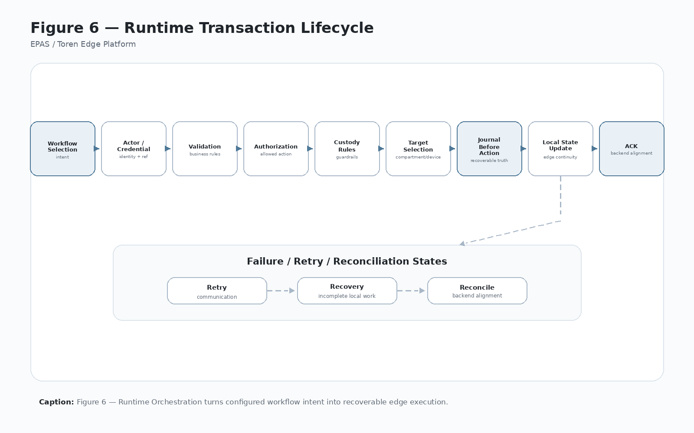

**Caption:** Figure 6 — Runtime Orchestration coordinates configured workflow intent, validation, authorization, custody rules, hardware action, local state, transaction journal, ACK, and reconciliation into one governed transaction lifecycle.

## 6.3 Primary Responsibilities

Runtime Orchestration owns the live coordination of a governed physical-edge transaction. Its responsibilities include:

- Starting and ending transaction execution.
- Loading the active workflow definition and workflow action.
- Establishing transaction context before physical action.
- Assigning or propagating request IDs, transaction IDs, command IDs, correlation IDs, timestamps, and workflow context.
- Capturing actor, credential, reference, asset, package, device, work order, or other configured input.
- Calling validation and authorization services in the configured order.
- Consulting custody rules before custody-changing actions occur.
- Selecting, reserving, or confirming the physical compartment or controlled device when required.
- Creating and updating transaction journal state.
- Calling hardware abstraction to perform physical action.
- Updating local operational state after physical action.
- Sending acknowledgement to backend services.
- Classifying failures and deciding whether to fail, retry, abandon, or require reconciliation.
- Preserving enough evidence for recovery and administrative review.

Runtime Orchestration must coordinate these responsibilities without absorbing the ownership of workflow definition, custody semantics, hardware protocols, backend authority, local storage mechanics, or security policy.

## 6.4 Boundaries and Non-Responsibilities

Runtime Orchestration owns execution coordination. It does not own the meaning of every action it coordinates.

Boundary examples:

- The Configurable Workflow Engine defines the workflow key, action, steps, and configured intent.
- Backend Integration owns API transport, request/response interpretation, retry policy, and backend contract behavior.
- Custody Governance owns valid custody states and transition rules.
- Hardware Abstraction owns scanner, reader, relay, controller, door-sensor, and peripheral behavior.
- Local Persistence owns durable storage mechanics and local data access.
- Transaction Integrity owns durable transaction journal state and recovery semantics.
- Security Architecture owns identity, role, permission, credential, and trust-boundary requirements.
- Administrative Services owns governed support and recovery actions outside the normal transaction path.

Runtime Orchestration should therefore call collaborators through explicit service boundaries and preserve the evidence of what each collaborator decided or performed.

## 6.5 Interfaces and Collaborators

Runtime Orchestration collaborates with nearly every Platform Technology:

- **Configurable Workflow Engine** provides the active workflow definition, action, steps, labels, validation profile, and configured requirements.
- **Security Architecture** supplies or evaluates actor identity, credential context, role constraints, and permission boundaries.
- **Backend Integration** performs validation, authorization, acknowledgement, reconciliation submission, and configuration-dependent backend calls.
- **Custody Governance** evaluates whether the requested custody action and state transition are valid.
- **Hardware Abstraction** performs physical input capture and physical output actions such as opening a compartment or reading door state.
- **Local Persistence** records locker, compartment, workflow, configuration, and local operational state.
- **Transaction Integrity** records transaction progress, intermediate states, failures, ACK status, and recovery state.
- **Cross-Cutting Services** provide logging, correlation, diagnostics, time services, serialization, and error classification.
- **Administrative Services** reviews, retries, reconciles, or resolves transactions that cannot complete normally.

Runtime Orchestration should make collaborator boundaries visible in code, logs, journal records, and diagnostic evidence.

## 6.6 Data Ownership

Runtime Orchestration does not own all transaction data permanently, but it coordinates the creation, propagation, and preservation of runtime context.

Runtime context should include:

- Request ID.
- Transaction ID.
- Command ID where applicable.
- Correlation ID.
- Workflow key.
- Workflow action.
- Workflow version or configuration reference where available.
- Actor ID or credential reference.
- Requested action type.
- Asset, package, device, work order, or reference value.
- Kiosk or edge-node ID.
- Locker bank, compartment group, or controlled-device group ID.
- Selected locker, compartment, or device identifier.
- Validation result.
- Authorization result.
- Hardware command result.
- Local state update result.
- ACK result.
- Failure classification.
- Terminal, pending, or reconciliation-required state.

Runtime Orchestration owns the propagation and consistency of this context during execution. The durable record of that context is owned by Transaction Integrity, Local Persistence, Backend Integration, Audit, or the appropriate collaborating Platform Technology.

## 6.7 Operational Model

A typical governed runtime sequence includes:

1. Select or receive the configured workflow.
2. Validate that the workflow is enabled and executable.
3. Create transaction context and correlation identifiers.
4. Capture actor, credential, or service identity.
5. Capture configured reference input such as asset, package, device, work order, or code.
6. Call validation services using explicit workflow, site, kiosk, locker bank, actor, and reference context.
7. Call authorization services when required by workflow or policy.
8. Evaluate custody rules for the requested workflow action.
9. Select, reserve, or confirm a compartment or controlled device.
10. Create or update the transaction journal before physical action.
11. Command hardware through Hardware Abstraction.
12. Confirm physical action where hardware permits.
13. Update local operational state.
14. Send acknowledgement to backend services.
15. Mark the transaction completed, failed, abandoned, ACK-pending, ACK-failed, or needs-reconciliation.
16. Write audit and diagnostic evidence.

The order matters. A governed physical action should not be allowed to occur before the platform has enough context to explain and recover it.

## 6.8 Failure Modes

Runtime Orchestration must anticipate failures at every step because runtime failures occur while a physical event may be partially completed.

Representative failure modes include:

- Workflow missing, disabled, stale, or incompatible.
- Actor or credential missing, invalid, expired, or unauthorized.
- Reference, asset, package, device, work order, or code invalid.
- Backend validation unavailable or rejected.
- Backend authorization unavailable or rejected.
- Custody rule rejects the requested transition.
- No eligible compartment or controlled device is available.
- Compartment selected but cannot be reserved or confirmed.
- Hardware command fails.
- Hardware command succeeds but confirmation is unavailable or ambiguous.
- Door opens but local state update fails.
- Local state updates but backend acknowledgement fails.
- Application restarts after physical action but before ACK.
- Operator abandons the transaction.
- Duplicate scan, repeated command, timeout, or race condition occurs.
- Transaction journal cannot be updated.
- Error classification is incomplete.

Failure handling should preserve a safe and explainable state. When a failure occurs before physical action, the transaction may be rejected or abandoned. When a failure occurs during or after physical action, the platform should preserve local evidence and move toward retry, recovery, or reconciliation rather than pretending the transaction never happened.

## 6.9 Configuration Model

Runtime Orchestration consumes configuration from other Platform Technologies. It should not hide configuration inside procedural code.

Configuration inputs may include:

- Active workflow definition and workflow version.
- Required steps and input sequence.
- Validation profile.
- Authorization requirement policy.
- Assignment or size-selection policy.
- Custody transition rules.
- Hardware mapping and controller configuration.
- Timeout and retry settings.
- ACK and reconciliation policy.
- Administrative recovery policy.
- Logging, tracing, and diagnostic settings.
- Security and permission requirements.

Runtime behavior should be deterministic for a given workflow configuration, actor context, input set, hardware state, backend response, and local state.

## 6.10 Security and Audit Considerations

Runtime Orchestration is the point where business authority becomes physical action, so it is a critical security and audit boundary.

Security and audit requirements include:

- Physical action should require explicit transaction context.
- Actor or credential context should be captured before governed action.
- Backend validation and authorization should carry explicit identity and workflow context.
- The selected compartment or device should be tied to the transaction record.
- Hardware command attempts and results should be logged or journaled.
- Local state updates should be traceable to the transaction.
- ACK success or failure should be recorded.
- Failure classification should be durable enough for support and reconciliation.
- Administrative recovery should preserve the original runtime evidence.

The platform should be able to reconstruct the execution path from workflow selection through physical action and acknowledgement.

## 6.11 ACK and Reconciliation Path

Runtime Orchestration must treat acknowledgement and reconciliation as part of the transaction lifecycle, not as incidental backend cleanup.

A successful physical-edge transaction should normally produce an ACK containing enough context for backend systems to understand what occurred. That context should include kiosk or edge-node identity, locker bank or controlled-device group identity, workflow key, workflow action, actor identity where applicable, asset/package/device/reference values, selected compartment or device, timestamps, request or correlation identifiers, and the resulting action state.

If ACK fails after local physical action or local state change, Runtime Orchestration should not erase the transaction. It should preserve the transaction as ACK-pending, ACK-failed, needs-retry, or needs-reconciliation according to Transaction Integrity rules. Administrative Services may later review and resolve the transaction, but the original runtime evidence must remain intact.

## 6.12 Commercial Significance

Runtime Orchestration is commercially significant because it is the repeatable execution pattern that makes multiple products and licensee deployments behave consistently. It allows different workflows and hardware configurations to inherit a common operational backbone.

A strong orchestration model reduces support cost, improves customer confidence, supports auditability, and makes new deployments easier to certify and explain. It is one of the clearest places where the Toren Edge Platform becomes more valuable than a one-off kiosk application.

## 6.13 IP Significance

Runtime Orchestration contributes to Toren's intellectual-property position by defining a repeatable method for converting configured workflow intent into governed physical-edge execution while preserving transaction context, local truth, backend acknowledgement, and recovery evidence.

The protectable value is not the idea of opening a compartment. The value is the coordinated orchestration method that connects identity, workflow, authorization, custody, hardware action, local persistence, transaction journaling, ACK, and reconciliation into a recoverable platform transaction.

## 6.14 Related Implementation Evidence

Candidate implementation evidence may include:

- Transaction execution services.
- Runtime context objects.
- Workflow selection and step progression logic.
- Validation and authorization service calls.
- Locker or compartment assignment services.
- Hardware command service calls.
- Local state update methods.
- Transaction journal table and state transitions.
- ACK request DTOs and service methods.
- Reconciliation request DTOs and service methods.
- Correlation ID and request ID propagation.
- Startup recovery and incomplete transaction handling.
- Audit logs and diagnostic traces.
- Error classification and retry handling.

This evidence should be expanded in Appendix F as the implementation matures.

## 6.15 Boundary Rule

Runtime Orchestration owns the coordinated execution of a governed transaction. It does not own workflow definition, custody semantics, hardware protocols, backend business authority, local storage mechanics, security policy, or administrative recovery policy. Its responsibility is to preserve transaction context, call the right collaborators in the right order, prevent unsafe physical action, and ensure every transaction reaches a terminal, retry, failure, abandoned, ACK-pending, or reconciliation-required state.

---

---

# Part II — Operational Trust and Custody

---

# Chapter 7 — Custody Governance

## 7.1 Purpose

Custody Governance defines how the Toren Edge Platform treats assets, packages, devices, compartments, actors, and actions as governed custody objects. It establishes the state vocabulary, transition rules, compartment semantics, exception handling, and reconciliation expectations needed to explain who had authority over an object, where that object was physically located, and what evidence supports the custody record.

Custody Governance is the Platform Technology that prevents physical-edge execution from becoming a loose collection of scans, door opens, and database updates. It gives those events operational meaning.

## 7.2 Problem Addressed

Physical-edge systems often confuse inventory, compartment state, and custody. Inventory may say an object exists. A compartment record may say a door or bin is occupied. A backend asset record may say an item is available, assigned, or checked out. None of those facts alone proves custody.

Custody requires a governed explanation of authority, location, action, timing, and evidence. Without Custody Governance, the platform can open a compartment and update a database but still fail to answer whether an object was staged, retrieved, returned, defective, reserved, abandoned, or in need of reconciliation.

Custody Governance addresses this by defining valid states and transitions across assets, packages, devices, compartments, actors, and workflow actions. It ensures that physical state and business state may diverge temporarily during real-world failure, but that the divergence is visible, journaled, and reconcilable.

## Figure 7 — Custody State Model

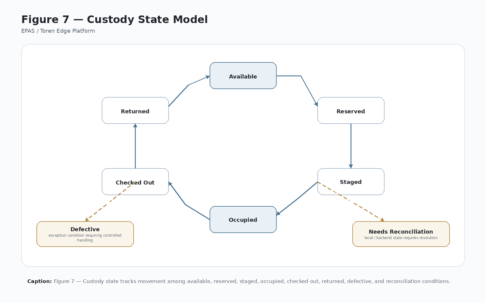

**Caption:** Figure 7 — Custody Governance defines valid custody states and transitions for assets, packages, devices, compartments, actors, and physical-edge actions.

## 7.3 Primary Responsibilities

Custody Governance owns:

- Custody-state vocabulary.
- Valid custody transitions.
- Relationship between workflow actions and custody outcomes.
- Relationship between custody objects and physical compartments.
- Compartment occupancy semantics.
- Reservation semantics and expiration behavior.
- Defect, exception, and condition semantics.
- Rules for staging, pickup, checkout, return, retrieval, deposit, exchange, release, and reconciliation.
- Rules for when local physical state may differ from backend business state.
- Requirements for evidence needed to support a custody transition.
- Conditions that require administrative review or reconciliation.

Custody Governance must make custody meaning explicit enough that Runtime Orchestration, Transaction Integrity, Local Persistence, Backend Integration, and Administrative Services can preserve and explain the state of a physical-edge transaction.

## 7.4 Custody Concepts

Custody is not merely inventory. Custody means the platform can explain:

- which object was involved,
- who or what had authority over it,
- where it was physically located,
- what workflow action changed its state,
- when the action occurred,
- what evidence supports the transition,
- and what system or administrator must resolve any ambiguity.

Custody objects may include:

- Serialized assets.
- Packages.
- Devices.
- Equipment.
- Inventory items.
- Work-order controlled objects.
- Returned or defective objects.
- Future controlled physical objects governed by the platform.

Custody locations may include lockers, compartments, cabinets, controlled bins, device bays, storage locations, or other locally controlled physical endpoints.

## 7.5 Custody State Vocabulary

Representative custody states include:

- **Available** — The object is available for assignment, staging, checkout, pickup, or release.
- **Reserved** — The object or compartment has been allocated for a pending transaction but the physical action has not fully completed.
- **Staged** — The object has been placed into a controlled location for later retrieval, pickup, checkout, or processing.
- **Occupied** — A compartment or controlled location is known or believed to contain an object.
- **Checked Out** — The object has been released to an actor, user, service, or downstream process.
- **Retrieved** — The object has been removed from a controlled location as part of an authorized retrieval or pickup action.
- **Returned** — The object has been placed back into platform custody after use or release.
- **Defective** — The object has been marked with a condition or disposition requiring special handling.
- **Unavailable** — The object or compartment is not eligible for normal workflow use.
- **Out of Service** — The compartment, device, or location has been administratively removed from service.
- **Unknown** — The platform cannot confidently determine the current physical or custody state.
- **Needs Reconciliation** — Local and backend state, physical evidence, or transaction records require review and resolution.

The exact vocabulary may be extended by product or deployment, but the platform should preserve stable canonical meanings for governed custody transitions.

## 7.6 Compartment Custody

A compartment is an operational custody location. Its state must be governed independently of the backend object record because physical compartments can change state even when backend communication fails.

Compartment state should include:

- Enabled or disabled.
- Vacant, occupied, reserved, unavailable, unknown, or out of service.
- Current asset, package, device, or reference value where applicable.
- Door state where hardware supports detection.
- Presence state where hardware supports detection.
- Reservation expiration where applicable.
- Last transaction reference.
- Last known actor or workflow context where appropriate.
- Reconciliation status where physical and system state may differ.

A compartment state change should be tied to transaction context whenever it results from a governed runtime action.

## 7.7 Relationship to Workflow Actions

Workflow actions give custody transitions their intent. The same physical action may have different custody meaning depending on the workflow.

Examples:

- `stage` may move an object from available or expected state into staged/occupied platform custody.
- `pickup` may move an object from staged or occupied state to retrieved or checked-out state.
- `checkout` may move a device from available or staged state to checked-out state.
- `return` may move an object from checked-out state to returned, staged, or occupied state.
- `exchange` may combine retrieval of one object with return or staging of another.
- `deposit` may place an object into platform custody without implying immediate availability.
- `defect` or a defect option may change object condition without completing normal custody release.

Custody Governance should define which transitions are valid for each workflow action and which transitions require backend authority, local evidence, administrative review, or reconciliation.

## 7.8 Interfaces and Collaborators

Custody Governance collaborates with:

- **Configurable Workflow Engine** to interpret workflow action and configured intent.
- **Runtime Orchestration** to evaluate whether a custody transition may occur during live execution.
- **Transaction Integrity** to preserve custody-related transaction progress and recovery states.
- **Local Persistence** to store local compartment and custody state.
- **Backend Integration** to exchange validation, authorization, ACK, and reconciliation context.
- **Hardware Abstraction** to receive door, presence, or compartment evidence where available.
- **Administrative Services** to review, correct, reconcile, or mark custody exceptions.
- **Security Architecture** to ensure custody-changing actions require proper authority.
- **Cross-Cutting Services** to log, trace, and classify custody-related events.

Custody Governance should not be buried in UI code, backend DTO assumptions, or locker table values alone.

## 7.9 Data Ownership

Custody Governance governs the meaning of custody-related data, including:

- Custody object identifiers.
- Custody object type.
- Current custody state.
- Current condition or disposition.
- Current compartment or controlled-location reference.
- Actor, workflow, and action associated with the last transition.
- Reservation ownership and expiration.
- Defect or exception status.
- Reconciliation status.
- Last transaction reference.
- Evidence required to support a transition.

Local Persistence may store the data, and Backend Integration may transmit related records, but Custody Governance owns the meaning of custody states and transitions.

## 7.10 Operational Model

A typical custody-governed transaction includes:

1. Receive workflow action and transaction context from Runtime Orchestration.
2. Identify the custody object and current known state.
3. Identify the compartment or physical custody location where applicable.
4. Evaluate whether the requested transition is allowed.
5. Confirm required backend authority if the transition requires enterprise approval.
6. Reserve, stage, occupy, release, return, mark defective, or reconcile according to state rules.
7. Record local custody and compartment state.
8. Preserve transition evidence in the transaction journal and audit trail.
9. Send custody outcome through ACK or reconciliation path.
10. Mark exceptions as failed, unknown, or needs-reconciliation rather than hiding ambiguity.

Custody transitions should be deterministic for the same workflow action, actor context, object state, compartment state, backend result, and physical evidence.

## 7.11 Failure Modes

Representative custody failure modes include:

- Object state is unknown or missing.
- Object is not eligible for requested action.
- Compartment is occupied when expected vacant.
- Compartment is vacant when expected occupied.
- Reservation expires before physical action completes.
- Door opens but object presence cannot be confirmed.
- Backend says object is available but local compartment state says occupied.
- Local state says staged but backend does not acknowledge the stage.
- Object is returned as defective without proper disposition context.
- Actor retrieves from the wrong compartment.
- Hardware evidence conflicts with database state.
- Administrative correction changes state without adequate evidence.
- Custody transition completes locally but ACK fails.

Failures should produce visible custody status, durable transaction evidence, and a reconciliation path.

## 7.12 Security and Audit Considerations

Custody-changing actions must be governed because they affect responsibility for physical objects.

Security and audit requirements include:

- Actor identity or credential context should be tied to custody transitions where applicable.
- Workflow key and workflow action should be recorded with custody changes.
- Backend authorization should be recorded when required.
- Physical location and compartment identity should be recorded.
- Defect, exception, and administrative correction actions should be audited.
- Custody state changes should preserve previous state, new state, timestamp, actor, and transaction reference where practical.
- Reconciliation should not erase original evidence.

The platform must be able to explain why an object changed state and what evidence supports that change.

## 7.13 Commercial Significance

Custody Governance is commercially significant because it allows multiple products and deployments to share a common concept of controlled physical responsibility. A customer may describe the workflow as pickup, checkout, staging, return, exchange, or equipment issue, but the platform can reuse the same custody model underneath.

This improves supportability, strengthens audit confidence, and makes new custody-based products easier to configure and license.

## 7.14 IP Significance

Custody Governance contributes to Toren's intellectual-property position by defining a repeatable method for connecting workflow intent, actor authority, physical location, local state, backend state, transaction evidence, and reconciliation into a governed custody model.

The protectable value is not merely tracking an item. The value is the custody governance method that preserves operational truth across physical actions, backend authority, local persistence, and failure recovery.

## 7.15 Related Implementation Evidence

Candidate implementation evidence may include:

- Locker status tables.
- Asset status records.
- Reservation records.
- Current asset or package references on compartment records.
- Workflow action fields.
- Defect option handling.
- Transaction journal custody states.
- ACK payloads containing custody outcome.
- Reconciliation DTOs.
- Administrative correction logs.
- Door or presence sensor logs.

This evidence should be expanded in Appendix F as the implementation matures.

## 7.16 Boundary Rule

Custody Governance owns custody semantics, valid transitions, exception meaning, and the relationship between physical custody locations and custody objects. It does not own relay commands, scanner input, UI rendering, API transport, storage mechanics, or administrative authority. It collaborates with those technologies to keep physical state, business authorization, transaction evidence, and custody meaning aligned.

---

# Chapter 8 — Transaction Integrity

## 8.1 Purpose

Transaction Integrity protects the Toren Edge Platform from losing the truth of what happened during governed physical-edge operations. It provides the durable transaction journal, state progression, recovery model, ACK tracking, retry path, and reconciliation evidence needed when runtime execution is interrupted, partially completed, rejected, or ambiguous.

Transaction Integrity is the Platform Technology that turns physical-edge execution into recoverable operational truth.

## 8.2 Problem Addressed

Physical-edge transactions are not ordinary screen events. Once a compartment opens, a relay fires, a device is released, or an object is placed into custody, the platform must be able to explain what happened even if the application restarts, the network fails, the operator walks away, backend acknowledgement is rejected, or support must intervene later.

Without Transaction Integrity, the system may know that a workflow began but not whether the door opened, whether local state changed, whether ACK failed, or whether reconciliation is required. That creates operational risk and support ambiguity.

## Figure 8 — Transaction Journal and Recovery Model

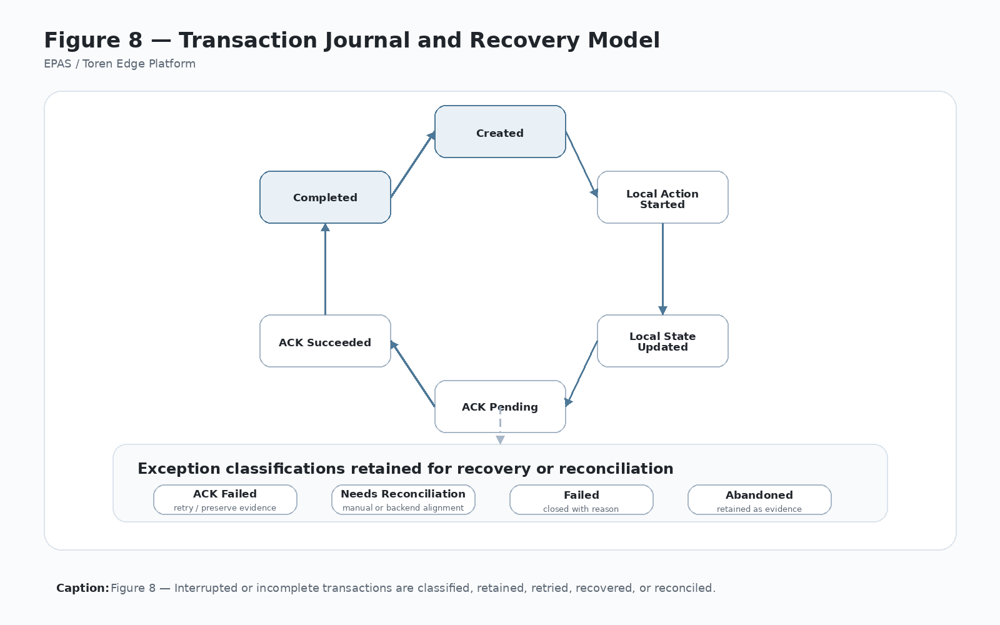

**Caption:** Figure 8 — Transaction Integrity preserves local transaction truth and provides recovery, retry, audit, and reconciliation paths when governed physical transactions are interrupted or incomplete.

## 8.3 Primary Responsibilities

Transaction Integrity owns:

- Durable transaction journal structure.
- Transaction state vocabulary.
- Transaction state progression rules.
- Required transaction identifiers and correlation fields.
- Recording of major runtime milestones.
- Recording of physical-action attempts and results.
- ACK state and retry status.
- Incomplete transaction detection.
- Startup recovery behavior.
- Reconciliation-required classification.
- Administrative review evidence.
- Error classification related to transaction progress.
- Preservation of original transaction evidence after failure.

Transaction Integrity does not make every runtime decision, but it preserves the evidence needed to understand and recover those decisions.

## 8.4 Transaction Journal

The platform should maintain a durable transaction journal for critical workflows. A journal entry should include:

- Request ID.
- Transaction ID.
- Command ID where applicable.
- Correlation ID.
- Workflow key.
- Workflow action.
- Workflow version or configuration reference where available.
- Actor ID or credential reference.
- Asset, package, device, work order, or reference value.
- Kiosk or edge-node ID.
- Locker bank or controlled-device group ID.
- Locker, compartment, or device identifier.
- Action type.
- Current transaction state.
- Previous transaction state where useful.
- Major timestamps.
- Validation and authorization outcomes.
- Hardware command result.
- Local state update result.
- ACK result.
- Retry count and retry status.
- Error code, error category, and diagnostic notes.
- Reconciliation status.

The transaction journal should survive application restarts and be inspectable by governed administrative tools.

## 8.5 Transaction States

Representative transaction states include:

- **Created** — Transaction context has been started.
- **Validated** — Required validation succeeded.
- **AuthorizationFailed** — Authorization was required and failed.
- **Authorized** — Required authorization succeeded.
- **CompartmentAssigned** — A compartment or controlled device was selected or reserved.
- **DoorCommanded** — Hardware action was attempted.
- **DoorOpened** — Door-open or command success evidence exists.
- **PhysicalActionConfirmed** — Physical completion was detected or confirmed where possible.
- **LocalStateUpdated** — Local operational state was updated.
- **AckPending** — Backend acknowledgement is required or queued.
- **AckSucceeded** — Backend acknowledgement succeeded.
- **AckFailed** — Backend acknowledgement failed after local action or state change.
- **RetryPending** — A retry path is available.
- **NeedsReconciliation** — Human, backend, or administrative reconciliation is required.
- **Completed** — The transaction reached a successful terminal state.
- **Failed** — The transaction failed before completion.
- **Abandoned** — The transaction was abandoned or timed out.

These states should align with Runtime Orchestration in Figure 6 and Custody Governance in Figure 7.

## 8.6 Interfaces and Collaborators

Transaction Integrity collaborates with:

- **Runtime Orchestration** to receive transaction milestones and state changes.
- **Configurable Workflow Engine** to preserve workflow key, action, and version context.
- **Custody Governance** to preserve custody transition evidence and reconciliation status.
- **Hardware Abstraction** to record command attempts, command results, and hardware event evidence.
- **Local Persistence** to store durable journal records.
- **Backend Integration** to record ACK, retry, and reconciliation status.
- **Administrative Services** to review, retry, resolve, or reconcile incomplete transactions.
- **Cross-Cutting Services** to supply timestamps, correlation IDs, logs, diagnostics, and error classification.
- **Security Architecture** to preserve actor identity and permission context where applicable.

## 8.7 Operational Model

A typical transaction integrity sequence includes:

1. Create a journal entry when governed runtime execution begins.
2. Record workflow context, actor context, identifiers, and requested action.
3. Update journal state after validation and authorization milestones.
4. Record compartment or controlled-device assignment before physical action.
5. Record hardware command attempt before or at the time of command.
6. Record hardware result or ambiguity.
7. Record local state update result.
8. Mark ACK pending before backend acknowledgement is attempted when local action has occurred.
9. Mark ACK succeeded, ACK failed, retry pending, or needs reconciliation.
10. Mark terminal completed, failed, abandoned, or reconciled state.
11. Preserve enough evidence for startup recovery and administrative review.

The journal should never skip over a physical action without durable evidence that the action was attempted, completed, failed, or ambiguous.

## 8.8 Startup Recovery

Startup recovery must inspect incomplete transactions and move them toward a safe state. The platform should never rely on operator memory to reconstruct whether a door opened or an asset was staged.

Recovery behavior should classify incomplete transactions into categories such as:

- Safe to abandon because no physical action occurred.
- Safe to retry validation or authorization.
- Physical action may have occurred; administrative review required.
- Local state changed but ACK failed; retry ACK.
- Local/backend state conflict; reconciliation required.
- Hardware state unknown; support review required.

Startup recovery should preserve the original transaction record and append recovery actions rather than rewriting history.

## 8.9 Failure Modes

Representative failure modes include:

- Journal entry cannot be created.
- Transaction state cannot be updated.
- Application crashes after authorization but before door command.
- Door command occurs but result is not recorded.
- Door opens but local state update fails.
- Local state updates but ACK fails.
- ACK succeeds but local terminal state is not recorded.
- Transaction ID or correlation ID is missing.
- Duplicate transaction or duplicate ACK occurs.
- Retry count exceeds allowed limit.
- Startup recovery cannot determine physical status.
- Administrative user resolves transaction without preserving evidence.

Failure handling should favor visibility over false completion.

## 8.10 Configuration Model

Transaction Integrity may consume configuration such as:

- Journal retention policy.
- Retry limits and retry intervals.
- ACK retry policy.
- Reconciliation thresholds.
- Timeout rules.
- Terminal-state rules.
- Recovery classification rules.
- Administrative review permissions.
- Diagnostic export settings.

Configuration should not weaken the requirement that critical physical transactions have durable evidence.

## 8.11 Security and Audit Considerations

Transaction journal records can contain sensitive operational evidence. They must be protected against unauthorized editing, deletion, or silent overwrite.

Security and audit requirements include:

- Journal changes should be append-friendly or otherwise auditable.
- Administrative recovery should record actor, timestamp, reason, and action.
- Failed ACK and reconciliation states should remain visible.
- Sensitive credential values should be protected or referenced appropriately.
- Transaction records should support support review without exposing unnecessary secrets.
- Original failure evidence should not be erased by correction actions.

## 8.12 Commercial Significance

Transaction Integrity is commercially significant because it reduces support ambiguity and builds customer trust. Customers care not only that the platform works when everything succeeds, but that it can explain what happened when something fails.

A strong transaction integrity model makes the platform more deployable, supportable, auditable, and certifiable across products and licensee implementations.

## 8.13 IP Significance

Transaction Integrity contributes to Toren's intellectual-property position by defining a durable recovery model for governed physical-edge transactions. The value is the method of preserving transaction truth across workflow, identity, hardware action, local state, backend ACK, retry, recovery, and reconciliation.

## 8.14 Related Implementation Evidence

Candidate implementation evidence may include:

- Transaction journal table schema.
- Transaction state enum.
- Recovery service logic.
- ACK retry records.
- Reconciliation queue.
- Runtime transaction context objects.
- Audit logs tied to transaction IDs.
- Error classification records.
- Startup recovery traces.
- Administrative recovery screens.

## 8.15 Boundary Rule

Transaction Integrity owns durable transaction progress, evidence, recovery classification, ACK status, retry state, and reconciliation visibility. It does not decide business eligibility, custody semantics, UI copy, hardware protocols, backend business authority, or administrative permission policy. It preserves the evidence needed to determine what happened and what must happen next.

---

# Chapter 9 — Hardware Abstraction

## 9.1 Purpose

Hardware Abstraction isolates platform logic from specific physical devices. The Toren Edge Platform should not embed scanner, reader, relay-controller, sensor, camera, printer, display, or future device details inside workflow, custody, backend, or UI logic.

Hardware Abstraction is the Platform Technology that lets the platform control physical devices while keeping operational meaning above the device layer.

## 9.2 Problem Addressed

Physical-edge systems frequently become hard to maintain when device details leak into business logic. A workflow screen may know relay numbers. A backend call may assume a controller branch. A custody rule may depend on a sensor protocol. A support tool may test a door by duplicating production hardware code. Each leak makes future hardware substitutions more expensive.

Hardware Abstraction addresses this by placing all device-specific communication behind stable platform interfaces. Platform services ask for operations such as scan received, credential read, open compartment, read door state, test controller, or report device health. Adapters handle the details of the actual hardware.

## Figure 9 — Hardware Abstraction Layer

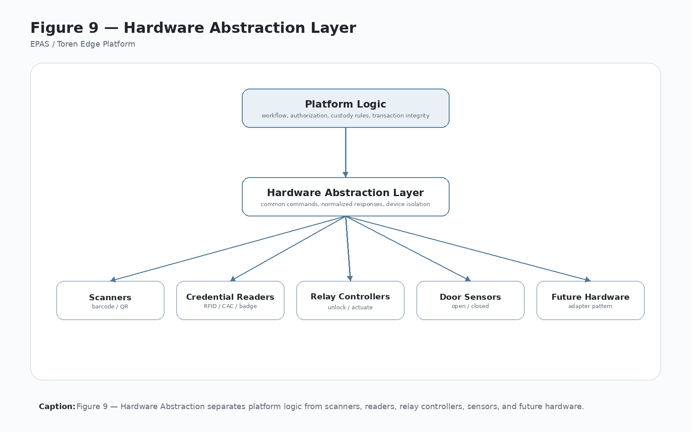

**Caption:** Figure 9 — Hardware Abstraction allows the platform to support multiple physical devices without embedding device details in workflow, custody, or business logic.

## 9.3 Primary Responsibilities

Hardware Abstraction owns:

- Device discovery where applicable.
- Device connection and disconnection behavior.
- Device-specific protocol handling.
- Controller addressing and command translation.
- Scanner, reader, relay, sensor, camera, printer, and peripheral adapters.
- Hardware health reporting.
- Hardware test operations.
- Device error classification.
- Device timing and command-result interpretation.
- Safe exposure of physical capabilities to Runtime Orchestration and Administrative Services.

The hardware layer should expose platform-level operations, not raw device details, except where diagnostics deliberately require low-level information.

## 9.4 Hardware Categories

The platform may interact with:

- Barcode scanners.
- RFID or credential readers.
- Relay controllers.
- Locker or compartment controllers.
- Door sensors.
- Presence sensors.
- Touch displays.
- Cameras.
- Printers.
- Environmental sensors.
- Network-connected controllers.
- USB HID peripherals.
- Serial devices.
- Future compartment-control technologies.

## 9.5 Adapter Principle

Each hardware family should be represented through an adapter that exposes stable platform operations such as:

- `StartScan`
- `StopScan`
- `CredentialRead`
- `OpenCompartment`
- `ReadDoorState`
- `ReadPresenceState`
- `TestController`
- `GetHealth`
- `ResetDevice`
- `ExportDiagnostics`

The adapter owns device-specific details. Platform services own operational meaning.

## 9.6 Boundaries and Non-Responsibilities

Hardware Abstraction owns device communication and device health semantics. It does not decide whether:

- a workflow is valid,
- an actor is authorized,
- a custody transition is allowed,
- a backend request should be accepted,
- a transaction should be reconciled,
- a product should enable a workflow,
- or an administrator should be allowed to override state.

Hardware Abstraction may report that a door opened, but Custody Governance determines what that means. It may report that a relay command succeeded, but Transaction Integrity preserves the transaction evidence.

## 9.7 Interfaces and Collaborators

Hardware Abstraction collaborates with:

- **Runtime Orchestration** for live physical actions.
- **Commissioning Technology** for controller mapping and hardware validation.
- **Administrative Services** for manual tests and diagnostics.
- **Transaction Integrity** for command evidence and hardware-result recording.
- **Custody Governance** for interpreting physical state changes.
- **Local Persistence** for hardware mapping and configuration records.
- **Cross-Cutting Services** for logs, health, diagnostics, timeouts, and error classification.
- **Security Architecture** for protecting hardware-control authority.
- **Deployment Architecture** for drivers, DLLs, OS dependencies, and device installation requirements.

## 9.8 Data Ownership

Hardware Abstraction governs the meaning of hardware-facing data, including:

- Device identifiers.
- Controller branch, port, channel, address, or relay mapping.
- Device type and adapter type.
- Connection status.
- Command status.
- Door state.
- Presence state.
- Device health.
- Hardware error codes.
- Diagnostic details.

Local Persistence may store the records, but Hardware Abstraction owns the interpretation of device-specific results.

## 9.9 Operational Model

A typical hardware operation includes:

1. Runtime or administrative service requests a platform-level hardware action.
2. Hardware Abstraction resolves the configured adapter and mapped device.
3. Adapter translates the request into device-specific protocol or driver calls.
4. Adapter reports command attempt, result, error, or ambiguity.
5. Cross-Cutting Services record diagnostics.
6. Transaction Integrity records command evidence when part of a governed transaction.
7. Runtime Orchestration or Administrative Services decide what happens next.

Hardware Abstraction should not silently convert device failures into business decisions.

## 9.10 Failure Modes

Representative failure modes include:

- Device unavailable.
- Device driver missing.
- Serial port unavailable.
- USB HID reader not detected.
- Controller branch mapping wrong.
- Relay command succeeds on wrong output.
- Door sensor unavailable or stuck.
- Presence sensor ambiguous.
- Scanner sends malformed input.
- Reader returns duplicate credential events.
- Command times out.
- Device health unknown.
- Adapter throws unclassified error.

Failures should be classified, logged, and surfaced to the caller without hiding uncertainty.

## 9.11 Configuration Model

Hardware configuration should include:

- Device type.
- Adapter type.
- Controller branch or connection path.
- Port, channel, address, relay, or compartment mapping.
- Timeout settings.
- Retry settings.
- Test mode settings.
- Hardware enabled/disabled state.
- Diagnostic verbosity.
- Driver or dependency requirements where relevant.

Configuration should be explicit and inspectable during commissioning and support.

## 9.12 Security and Audit Considerations

Hardware actions can cause physical consequences, so hardware control must be protected.

Security and audit requirements include:

- Governed hardware actions should require transaction context or administrative authority.
- Manual tests should be permissioned and logged.
- Hardware mapping changes should be audited.
- Device errors should preserve diagnostic context.
- Sensitive hardware configuration should be protected where applicable.
- Physical commands should be traceable to workflow or administrative action.

## 9.13 Commercial Significance

Hardware Abstraction is commercially significant because it allows Toren-based products to support different controllers, readers, scanners, sensors, and future devices without rewriting the platform. It reduces vendor lock-in and increases deployment flexibility.

## 9.14 IP Significance

Hardware Abstraction contributes to Toren's IP position by defining a repeatable method for separating physical device control from workflow, custody, transaction, and backend meaning while preserving governed execution and evidence.

## 9.15 Related Implementation Evidence

Candidate evidence may include:

- Scanner services.
- Credential reader adapters.
- Locker controller services.
- Controller branch mapping tables.
- Hardware diagnostic logs.
- Manual test screens.
- Door or presence sensor adapters.
- Device health reports.
- Driver/DLL integration notes.

## 9.16 Boundary Rule

Hardware Abstraction owns device communication, physical command translation, hardware result interpretation, and device health semantics. It does not own workflow validity, actor authority, custody meaning, backend business authority, transaction recovery, or administrative permission policy.

---

# Chapter 10 — Local Persistence

## 10.1 Purpose

Local Persistence gives each edge node durable operational memory. It stores the configuration, identity, workflow cache, locker or compartment state, hardware mapping, transaction journal, audit references, diagnostics, and reconciliation records needed for the platform to operate safely at the physical edge.

Local Persistence is the Platform Technology that prevents edge execution from depending entirely on live backend availability or volatile application memory.

## 10.2 Problem Addressed

Physical edge operations happen locally. Doors open locally. Credentials are scanned locally. Relays fire locally. Operators walk away locally. If the only durable truth is remote, the platform may lose the ability to explain what happened when connectivity fails or the application restarts.

Local Persistence addresses this by storing the information needed to preserve local operational truth until backend acknowledgement, reconciliation, or administrative resolution can complete.

## Figure 10 — Local Persistence Model

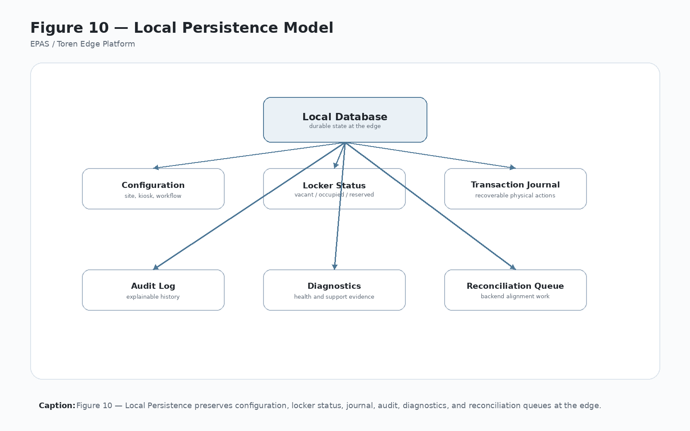

**Caption:** Figure 10 — Local Persistence gives the edge node durable operational memory for configuration, physical state, transaction recovery, audit, diagnostics, and reconciliation.

## 10.3 Primary Responsibilities

Local Persistence owns:

- Durable local storage mechanics.
- Local database initialization and migration support.
- Storage of commissioned identity and configuration.
- Locker bank and compartment records.
- Locker or compartment status records.
- Cached workflow configuration.
- Hardware mapping records.
- Transaction journal records.
- Reconciliation queue records.
- Administrative settings and support data.
- Diagnostic and audit references where stored locally.
- Data access patterns needed by local platform services.

Local Persistence should preserve platform state without becoming the owner of every state’s business meaning.

## 10.4 Local Data Categories

The local persistence model should include:

- Kiosk and site configuration.
- Customer, tenant, or licensee context.
- Locker bank and compartment records.
- Locker status records.
- Workflow configuration cache.
- Hardware mapping records.
- Transaction journal entries.
- Audit log index or references.
- Reconciliation queue.
- Administrative settings.
- Hardware health and diagnostic records.
- Version, migration, and schema readiness markers.

## 10.5 Boundaries and Non-Responsibilities

Local Persistence owns durable storage, not the meaning of every record.

Boundary examples:

- Custody Governance owns custody state meaning.
- Transaction Integrity owns journal state progression and recovery semantics.
- Configurable Workflow Engine owns workflow definition meaning.
- Commissioning owns initial identity binding.
- Hardware Abstraction owns device status interpretation.
- Backend Integration owns API contract state and remote acknowledgement meaning.
- Administrative Services owns governed correction workflows.

Local Persistence should not become a hidden business-rules engine simply because it stores important data.

## 10.6 Interfaces and Collaborators

Local Persistence collaborates with:

- **Commissioning Technology** to store identity, hardware topology, and initial state.
- **Configurable Workflow Engine** to cache and retrieve workflow definitions.
- **Runtime Orchestration** to read and update operational state.
- **Custody Governance** to persist custody and compartment status.
- **Transaction Integrity** to persist transaction journal state.
- **Backend Integration** to queue ACK and reconciliation records.
- **Hardware Abstraction** to store hardware mappings and diagnostic evidence.
- **Administrative Services** to inspect, correct, export, or reconcile local data.
- **Cross-Cutting Services** for diagnostics, logging, serialization, and error classification.
- **Security Architecture** for protected local configuration and access controls.

## 10.7 Data Ownership

Local Persistence owns storage mechanics for local records such as:

- Database files or local stores.
- Tables, collections, or serialized records.
- Schema version and migration status.
- Record creation and update operations.
- Local query access.
- Persistence error classification.
- Backup or support export behavior where applicable.

The platform technology that creates a record owns its meaning. Local Persistence owns the durable storage of that record.

## 10.8 Operational Model

A typical local persistence sequence includes:

1. Initialize or validate local database readiness.
2. Load commissioned identity and configuration.
3. Load workflow and hardware configuration.
4. Provide current compartment and custody state to runtime services.
5. Persist transaction journal milestones during execution.
6. Persist local state changes after physical action.
7. Queue ACK, retry, or reconciliation records when needed.
8. Support administrative review and export.
9. Preserve state across application restart and power loss.

Local Persistence should favor durability and explainability over convenience.

## 10.9 Failure Modes

Representative failure modes include:

- Local database unavailable.
- Schema migration fails.
- Record write fails after physical action.
- Record read returns stale or corrupt data.
- Workflow cache incompatible with runtime version.
- Hardware mapping missing or invalid.
- Transaction journal cannot be updated.
- Reconciliation queue cannot be written.
- Local storage full or inaccessible.
- Support export incomplete.
- Data conflict after backend synchronization.

Failures that occur after physical action should be treated as high-risk because they can weaken operational truth.

## 10.10 Configuration Model

Local persistence configuration may include:

- Database location.
- Schema version.
- Migration rules.
- Retention policy.
- Backup or export settings.
- Encryption or protection settings.
- Cache refresh settings.
- Retry and write-failure behavior.
- Diagnostic verbosity.

Configuration should be explicit and supportable in the field.

## 10.11 Security and Audit Considerations

Local data may contain identity, custody, transaction, and operational evidence. It must be protected from unauthorized access, tampering, and accidental loss.

Security and audit requirements include:

- Protected local configuration where sensitive values exist.
- Permissioned administrative access.
- Durable transaction and custody evidence.
- Audit trail for manual correction where applicable.
- Support export that avoids exposing secrets unnecessarily.
- Retention rules that preserve operational evidence long enough for reconciliation and support.

## 10.12 Persistence Principle

Local persistence should be treated as operational truth for physical edge events until reconciliation proves otherwise. Backend systems remain authoritative for enterprise business records, but the edge platform remains authoritative for what it physically executed. **Figure 10** and **Figure 11** should be interpreted together.

## 10.13 Commercial Significance

Local Persistence is commercially significant because it makes the platform reliable in real field conditions. Customers do not experience perfect networks, perfect operators, or perfect hardware. Durable local memory reduces support cost and increases confidence.

## 10.14 IP Significance

Local Persistence contributes to Toren's IP position by supporting a local-first operational truth model for governed physical-edge transactions, including transaction journaling, custody state, ACK/reconciliation queues, and administrative recovery evidence.

## 10.15 Related Implementation Evidence

Candidate evidence may include:

- SQLite schema.
- Locker and locker-status tables.
- Workflow cache tables or files.
- Transaction journal table.
- Reconciliation queue.
- Hardware mapping records.
- App settings records.
- Migration scripts.
- Support export files.
- Administrative review screens.

## 10.16 Boundary Rule

Local Persistence owns durable local storage mechanics and access to local platform records. It does not own the business, custody, workflow, hardware, security, or backend meaning of every stored value. Meaning is supplied by the Platform Technology that creates and consumes the record.

---

# Chapter 11 — Backend Integration

## 11.1 Purpose

Backend Integration connects edge execution with enterprise authority. It defines how the Toren Edge Platform validates actors, credentials, assets, packages, work orders, permissions, reservations, acknowledgements, reconciliation events, configuration distribution, and audit ingestion with backend systems.

Backend Integration is the Platform Technology that makes enterprise authority explicit while preserving the edge platform’s responsibility for local physical execution truth.

## 11.2 Problem Addressed

Edge systems become fragile when backend calls rely on hidden assumptions. If kiosk identity, locker bank identity, workflow key, workflow action, actor identity, request ID, or correlation ID is missing, backend systems cannot reliably determine what physical event occurred or which edge node produced it.

Backend Integration addresses this by defining explicit contracts between enterprise authority and edge execution. It clarifies what the backend owns, what the edge owns, and what context must pass between them.

## Figure 11 — Edge-to-Backend Responsibility Split

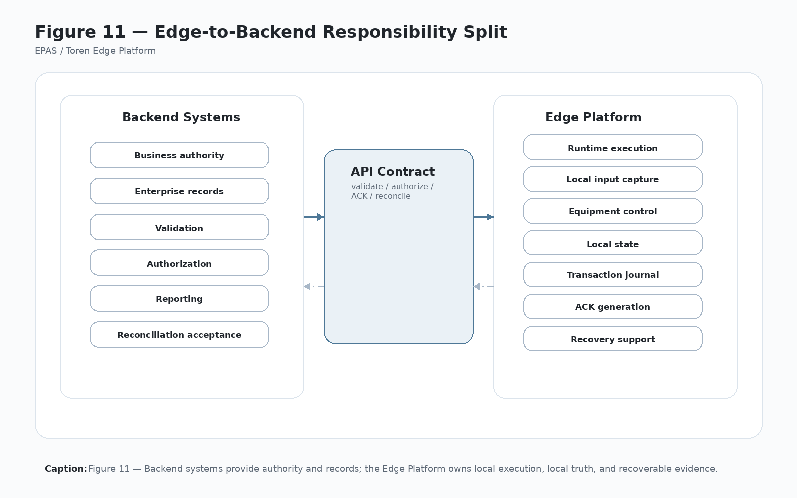

**Caption:** Figure 11 — Enterprise systems govern business authority; edge systems execute physical operations and preserve local truth until acknowledgement or reconciliation completes.

## 11.3 Primary Responsibilities

Backend Integration owns:

- API transport and endpoint configuration.
- Request/response DTO structure.
- Validation calls.
- Authorization calls.
- ACK calls.
- Reconciliation calls.
- Configuration sync where applicable.
- Backend error classification.
- Retry policy for backend communication.
- Interpretation of backend responses.
- Correlation between local transaction records and backend records.
- Observability of backend communication.

Backend Integration should make every enterprise-facing transaction explicit, traceable, and reviewable.

## 11.4 Backend Integration Responsibilities

Backend services typically provide:

- Actor validation.
- Credential validation.
- Asset, package, device, or work-order validation.
- Permission evaluation.
- Reservation creation or confirmation.
- Locker or compartment authorization.
- Transaction acknowledgement.
- Reconciliation processing.
- Configuration distribution.
- Audit ingestion.
- Reporting and enterprise record ownership.

The backend may own business authority, but it does not erase or replace the local edge record of physical execution.

## 11.5 Edge-to-Backend Contract

Every backend request should include enough identity and context for governance:

- Kiosk ID or edge-node ID.
- Locker bank or controlled-device group ID.
- Site or location ID.
- Client, tenant, customer, or licensee code.
- Workflow key.
- Workflow action.
- Workflow version where available.
- Actor ID or credential reference where applicable.
- Request ID.
- Transaction ID.
- Correlation ID.
- Timestamp.
- Relevant asset, package, device, work order, or reference values.
- Selected compartment or controlled-device identifier when applicable.
- Requested action and resulting action state when applicable.

The contract should be reviewed whenever workflow, custody, runtime, security, or ACK behavior changes.

## 11.6 Boundaries and Non-Responsibilities

Backend Integration owns enterprise communication, not local physical truth.

Boundary examples:

- Backend Integration may receive authorization; Runtime Orchestration coordinates the local transaction.
- Backend Integration may report backend acceptance; Transaction Integrity records whether ACK succeeded locally.
- Backend Integration may validate asset eligibility; Custody Governance determines local custody-state meaning.
- Backend Integration may distribute workflow configuration; Configurable Workflow Engine owns workflow interpretation.
- Backend Integration may accept audit evidence; Cross-Cutting Services and Transaction Integrity preserve local evidence.

Backend Integration should not erase local evidence when backend calls fail.

## 11.7 Interfaces and Collaborators

Backend Integration collaborates with:

- **Runtime Orchestration** for validation, authorization, ACK, and reconciliation calls.
- **Configurable Workflow Engine** for workflow context and validation profile selection.
- **Custody Governance** for custody transition meaning and reconciliation content.
- **Transaction Integrity** for ACK status, retry state, and transaction correlation.
- **Local Persistence** for queued requests, cached config, and retry records.
- **Security Architecture** for API authentication, service identity, certificates, and tokens.
- **Administrative Services** for manual retry, reconciliation review, and diagnostics.
- **Cross-Cutting Services** for logging, correlation, diagnostics, serialization, and error classification.

## 11.8 Operational Model

A typical backend integration sequence includes:

1. Runtime Orchestration creates transaction context.
2. Backend Integration prepares a request with explicit identity and workflow context.
3. Security Architecture supplies API authority or service identity.
4. Backend validates or authorizes the requested action.
5. Runtime Orchestration proceeds or fails based on response.
6. Local physical execution occurs through governed platform services.
7. Backend Integration sends ACK after local state and transaction evidence are available.
8. ACK succeeds, fails, retries, or moves to reconciliation.
9. Administrative Services may review unresolved backend communication failures.

## 11.9 Failure Modes

Representative failure modes include:

- Backend unavailable.
- Timeout.
- Authentication failure.
- Authorization rejection.
- Validation rejection.
- Missing identity field.
- Workflow key/action mismatch.
- Backend rejects ACK.
- Duplicate ACK.
- Local transaction exists but backend record missing.
- Backend record exists but local transaction incomplete.
- Configuration sync stale or incompatible.
- Reconciliation request rejected.

Backend failures after local physical action must preserve local evidence and move toward retry or reconciliation.

## 11.10 Configuration Model

Backend configuration may include:

- Endpoint URLs.
- Environment name.
- Tenant/customer/licensee context.
- API credentials or certificates.
- Timeout settings.
- Retry policy.
- Validation profile mapping.
- ACK endpoint mapping.
- Reconciliation endpoint mapping.
- Configuration sync policy.
- Diagnostic verbosity.

Configuration should be explicit, protected, and inspectable by authorized support personnel.

## 11.11 Security and Audit Considerations

Backend Integration is a security boundary between local physical execution and enterprise authority.

Security and audit requirements include:

- API authentication should be explicit.
- Kiosk and locker bank identity should be protected from spoofing.
- Sensitive tokens, secrets, and certificates should be protected.
- Backend requests should carry correlation identifiers.
- Failed requests should be logged without exposing secrets.
- ACK and reconciliation records should preserve original transaction evidence.
- Administrative retry should be permissioned and audited.

## 11.12 Implementation Alignment Note

Current locker-based implementation evidence demonstrates why this contract matters. Stage, checkout, and ACK flows must propagate the active workflow key, workflow action, kiosk identity, locker bank identity, and actor identity through validation, authorization, local state update, acknowledgement, and recovery. Any missing identity field weakens governance because the backend cannot reliably distinguish which edge node, locker bank, actor, workflow, or action produced the physical event.

## 11.13 Commercial Significance

Backend Integration is commercially significant because repeatable integration patterns reduce deployment cost and make new enterprise environments easier to support. The clearer the contract, the easier it is to license, implement, test, and defend the platform across customers and products.

## 11.14 IP Significance

Backend Integration contributes to Toren's IP position by defining the explicit split between enterprise authority and edge execution, along with the contract model that preserves workflow, identity, custody, transaction, ACK, and reconciliation context.

## 11.15 Related Implementation Evidence

Candidate evidence may include:

- Validate DTOs.
- Authorize DTOs.
- ACK DTOs.
- Reconcile DTOs.
- API service methods.
- Request ID and correlation ID propagation.
- Backend error logs.
- Retry queues.
- Configuration sync records.
- Authentication configuration.

## 11.16 Boundary Rule

Backend Integration owns API transport, contracts, request/response interpretation, retry behavior, backend communication observability, and enterprise communication context. It does not own physical execution truth and should not erase local transaction evidence when backend calls fail.

---

# Part III — Platform Operations

---

# Chapter 12 — Cross-Cutting Services

## 12.1 Purpose

Cross-Cutting Services support every Platform Technology in the Toren Edge Platform. They provide the observability, reliability, diagnostics, correlation, logging, serialization, time, retry, health, and support-export fabric needed for governed physical-edge execution.

Cross-Cutting Services are not a single feature. They are the shared operating fabric that makes the platform supportable and explainable across workflows, hardware, backend calls, local state, custody, transaction recovery, and administrative action.

## 12.2 Problem Addressed

Without cross-cutting services, each platform component invents its own logging, error handling, timestamps, identifiers, retries, diagnostics, and support output. That makes field support slow and makes transaction reconstruction unreliable.

Cross-Cutting Services address this by giving the platform shared conventions for tracing, classifying, logging, exporting, and diagnosing activity across the whole edge node.

## Figure 12 — Cross-Cutting Services Fabric

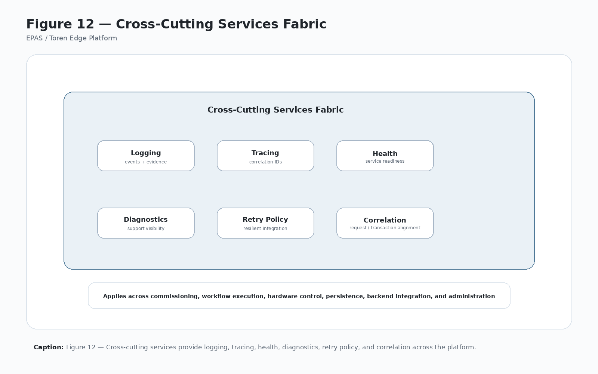

**Caption:** Figure 12 — Cross-Cutting Services create the observability, reliability, and supportability fabric that spans the full Toren Edge Platform.

## 12.3 Primary Responsibilities

Cross-Cutting Services own:

- Structured logging conventions.
- Audit logging support.
- Correlation ID propagation.
- Request ID and transaction trace support.
- Error classification.
- Retry policy support.
- Time services and timestamp consistency.
- Serialization and schema validation support.
- Configuration loading support.
- Health checks.
- Diagnostic export.
- Feature-flag support where applicable.
- Support bundle generation.
- Telemetry and operational signals where applicable.

## 12.4 Core Services

Core cross-cutting services include:

- Structured logging.
- File audit logging.
- Trace correlation.
- Error classification.
- Retry policy.
- Health checks.
- Configuration loading.
- Feature flags.
- Time services.
- Serialization and schema validation.
- Diagnostic export.
- Support bundles.
- Telemetry hooks.
- Configuration validation.

## 12.5 Boundaries and Non-Responsibilities

Cross-Cutting Services support platform operations but do not own workflow, custody, backend, hardware, security, or business meaning.

Boundary examples:

- Logging records what happened; it does not decide whether a custody transition is valid.
- Retry policy supports retries; Backend Integration owns backend-specific retry behavior.
- Time services provide consistent timestamps; Transaction Integrity owns transaction-state progression.
- Diagnostic export packages evidence; Administrative Services governs who may access it.
- Serialization support validates format; each Platform Technology owns semantic meaning.

## 12.6 Interfaces and Collaborators

Cross-Cutting Services collaborate with every Platform Technology. They should be available to:

- Commissioning for setup diagnostics.
- Workflow Engine for configuration validation and workflow traceability.
- Runtime Orchestration for transaction correlation.
- Custody Governance for custody-state evidence.
- Transaction Integrity for journal trace and recovery diagnostics.
- Hardware Abstraction for device logs and health.
- Local Persistence for storage errors and exports.
- Backend Integration for request/response tracing.
- Security Architecture for sensitive logging rules.
- Administrative Services for support bundles and diagnostics.
- Deployment Architecture for log locations and support tooling.
- Commercial Architecture for supportability and customer confidence.

## 12.7 Data Ownership

Cross-Cutting Services govern shared operational data such as:

- Correlation IDs.
- Request IDs where shared across services.
- Log event structure.
- Error category vocabulary.
- Diagnostic package structure.
- Health-check status format.
- Timestamp conventions.
- Serialization validation results.
- Support export manifest.

They should not own business-state or custody-state meaning unless the data is specifically a cross-cutting diagnostic artifact.

## 12.8 Operational Model

A typical cross-cutting flow includes:

1. Runtime begins a transaction and receives correlation identifiers.
2. Each Platform Technology logs major actions with shared identifiers.
3. Errors are classified using common vocabulary.
4. Retry behavior is applied according to owner-specific policy.
5. Health and diagnostics are updated.
6. Audit records are written for governed actions.
7. Support export can gather related logs, journal records, configuration, and diagnostics.
8. Administrative Services can review evidence without manually hunting across unrelated files.

## 12.9 Failure Modes

Representative failure modes include:

- Missing correlation IDs.
- Inconsistent timestamps.
- Logs too verbose or too sparse.
- Error recorded without classification.
- Sensitive value logged accidentally.
- Diagnostic export incomplete.
- Retry policy hidden in code.
- Health check reports success while dependency is failed.
- Support bundle omits transaction evidence.

Cross-cutting failures weaken supportability even when the transaction logic itself is correct.

## 12.10 Configuration Model

Configuration may include:

- Log level.
- Audit log location.
- Diagnostic export location.
- Correlation policy.
- Retry defaults.
- Health-check intervals.
- Feature flags.
- Serialization strictness.
- Support bundle content.
- Sensitive-field redaction rules.

## 12.11 Security and Audit Considerations

Cross-Cutting Services must help explain the platform without exposing secrets.

Requirements include:

- Redact credentials, tokens, secrets, and sensitive values.
- Preserve transaction identifiers needed for support.
- Ensure administrative exports are permissioned.
- Record administrative diagnostic actions.
- Avoid allowing logging failures to hide transaction failures.
- Preserve audit integrity for governed actions.

## 12.12 Correlation Principle

Every significant transaction should be traceable across UI activity, workflow execution, hardware command, local persistence, backend request, acknowledgement, and audit record. **Figure 12** should be used as the checklist for traceability coverage.

## 12.13 Commercial Significance

Cross-Cutting Services are commercially significant because they reduce support cost and make field behavior explainable. They turn complex multi-service execution into reviewable evidence.

## 12.14 IP Significance

Cross-Cutting Services contribute to Toren's IP position by supporting a platform-wide observability and diagnostic fabric for governed physical-edge execution.

## 12.15 Related Implementation Evidence

Candidate evidence may include:

- Structured log output.
- Audit log files.
- Correlation ID propagation.
- Error classification enums.
- Retry policies.
- Health check services.
- Diagnostic export tools.
- Support bundle manifests.
- Configuration loading services.

## 12.16 Boundary Rule

Cross-Cutting Services own shared observability, diagnostics, correlation, logging, serialization support, time consistency, retry-support conventions, and support-export structure. They do not own workflow intent, custody semantics, hardware protocols, backend business authority, transaction state meaning, or administrative permission policy.

---

# Chapter 13 — Security Architecture

## 13.1 Purpose

Security Architecture protects identities, permissions, credentials, operational authority, backend trust, administrative access, protected configuration, and system integrity for the Toren Edge Platform.

Security Architecture is the Platform Technology that ensures physical action is performed only under appropriate authority and that the evidence proving those actions remains trustworthy.

## 13.2 Problem Addressed

Physical-edge systems create real-world consequences. A weak security model can release a device, open a compartment, expose configuration, allow unlogged administrative changes, spoof kiosk identity, or corrupt custody evidence.

Security Architecture addresses this by defining trust boundaries around actors, credentials, kiosks, backend services, local administrators, hardware control, local persistence, configuration, and audit evidence.

## Figure 13 — Security Trust Boundary Model

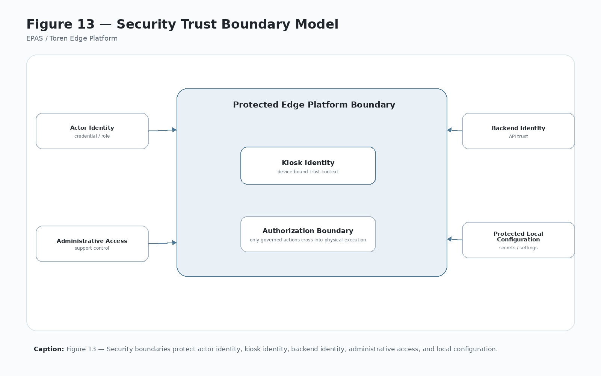

**Caption:** Figure 13 — Security Architecture protects the authority to perform physical actions and the evidence proving those actions occurred.

## 13.3 Primary Responsibilities

Security Architecture owns:

- Actor authentication requirements.
- Role and permission authorization model.
- Kiosk or edge-node identity protection.
- Backend service identity and API authentication requirements.
- Local administrative access model.
- Credential-reader trust assumptions.
- Protection of secrets, tokens, certificates, and sensitive configuration.
- Protected audit and transaction evidence requirements.
- Security expectations for support export and diagnostics.
- Trust-boundary documentation.

## 13.4 Security Domains

Security must address:

- Actor authentication.
- Role and permission authorization.
- Kiosk identity.
- Locker bank or controlled-device group identity.
- Backend service identity.
- Local administrative access.
- Credential-reader trust.
- API authentication.
- Local database protection.
- Configuration protection.
- Audit integrity.
- Hardware-control authority.
- Support-export access.

## 13.5 Boundaries and Non-Responsibilities

Security Architecture defines trust and authority requirements. It does not implement every workflow, custody, hardware, backend, or persistence rule.

Boundary examples:

- Security defines that administrative actions must be permissioned; Administrative Services implements governed admin workflows.
- Security defines that physical actions require authority; Runtime Orchestration coordinates the live transaction.
- Security defines protected secrets; Deployment Architecture and Local Persistence manage where they live.
- Security defines API trust expectations; Backend Integration implements authenticated calls.
- Security defines audit integrity requirements; Cross-Cutting Services and Transaction Integrity preserve evidence.

## 13.6 Interfaces and Collaborators

Security Architecture collaborates with:

- **Runtime Orchestration** for transaction authority and actor context.
- **Backend Integration** for API authentication and identity propagation.
- **Administrative Services** for local permissioned support actions.
- **Local Persistence** for protected configuration and local evidence.
- **Transaction Integrity** for tamper-resistant transaction evidence requirements.
- **Hardware Abstraction** for protecting physical control operations.
- **Configurable Workflow Engine** for workflow permission and shortcut review.
- **Commissioning Technology** for identity assignment and secure registration.
- **Deployment Architecture** for secrets, certificates, and runtime hardening.
- **Cross-Cutting Services** for redaction, audit logging, and secure diagnostics.

## 13.7 Data Ownership

Security Architecture governs the meaning and protection expectations for:

- Actor identifiers.
- Credential references.
- Roles and permissions.
- Kiosk identity.
- Backend identity.
- API tokens, certificates, or secrets.
- Administrative user context.
- Protected local settings.
- Audit integrity metadata.
- Sensitive fields in diagnostics and support exports.

## 13.8 Operational Model

A typical security-governed transaction includes:

1. Capture actor or credential context.
2. Validate identity and permissions locally or through backend authority.
3. Bind the transaction to kiosk, site, locker bank, workflow, and actor context.
4. Prevent physical action unless configured authority requirements are satisfied.
5. Protect sensitive data during logging, persistence, and API calls.
6. Preserve audit evidence.
7. Govern administrative recovery or override actions.

## 13.9 Failure Modes

Representative failure modes include:

- Missing actor identity.
- Credential read but no permission validation.
- Expired or invalid API credentials.
- Kiosk identity missing or spoofable.
- Admin access not permissioned.
- Sensitive values logged.
- Local configuration exposed.
- Hardware test available without authority.
- Audit record editable without evidence.
- Support export exposes secrets.

Security failures should be treated as governance failures, not merely technical errors.

## 13.10 Configuration Model

Security configuration may include:

- Role and permission mappings.
- Credential validation rules.
- API authentication settings.
- Certificate or secret references.
- Admin access settings.
- Local protection settings.
- Redaction rules.
- Audit retention requirements.
- Support-export restrictions.

## 13.11 Security and Audit Considerations

Physical action must require explicit authority. The platform should not treat possession of a scanned value as sufficient proof of permission unless the configured workflow deliberately allows it. The trust boundaries in **Figure 13** should be reviewed whenever a workflow shortcut is proposed.

## 13.12 Commercial Significance

Security Architecture is commercially significant because customers must trust that the platform controls real physical operations responsibly. Strong security supports enterprise acceptance, government/customer deployment, audit confidence, and licensing credibility.

## 13.13 IP Significance

Security Architecture contributes to Toren's IP position by documenting the governed trust-boundary model for physical-edge execution, including identity propagation, permissioned physical action, local evidence, and backend authority.

## 13.14 Related Implementation Evidence

Candidate evidence may include:

- Actor validation calls.
- Role and permission records.
- Kiosk identity configuration.
- Backend authentication configuration.
- Admin login and permission checks.
- Audit logs.
- Redaction rules.
- Protected configuration files.
- Certificate or token references.

## 13.15 Boundary Rule

Security Architecture owns trust boundaries, identity protection, authority requirements, and sensitive-data protection expectations. It does not own workflow meaning, custody transitions, hardware protocols, local storage mechanics, backend business rules, or administrative workflow implementation.

---

# Chapter 14 — Administrative Services

## 14.1 Purpose

Administrative Services allow trusted personnel to configure, diagnose, recover, reconcile, and support the Toren Edge Platform without bypassing governance. They provide controlled tools for field installers, site administrators, support technicians, and platform support personnel.

Administrative Services are the Platform Technology that makes support practical while keeping administrative action permissioned, logged, and explainable.

## 14.2 Problem Addressed

Every physical-edge platform needs support operations. Lockers must be tested. Controllers must be diagnosed. Workflows must be reviewed. Transactions may need recovery. Compartments may need to be taken out of service. Logs may need export. If these actions happen outside governance, they can corrupt custody records, weaken audit evidence, or hide operational problems.

Administrative Services address this by making support actions first-class governed platform actions rather than informal shortcuts.

## Figure 14 — Administrative Operations Model

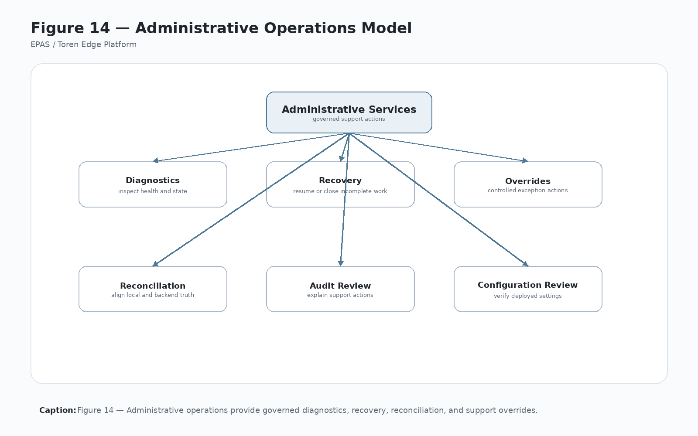

**Caption:** Figure 14 — Administrative Services provide controlled support, diagnostics, recovery, and override actions without bypassing platform governance.

## 14.3 Primary Responsibilities

Administrative Services own:

- Administrative user access flows.
- Locker, compartment, and device status review.
- Manual hardware tests.
- Controller connection tests.
- Workflow configuration review.
- Commissioning review and recommissioning support.
- Transaction journal inspection.
- Incomplete transaction recovery actions.
- Reconciliation review and submission.
- Log and diagnostic export.
- Out-of-service and return-to-service workflows.
- Administrative audit evidence.
- Support-oriented presentation of platform state.

## 14.4 Administrative Capabilities

Administrative services may include:

- Locker status review.
- Manual compartment test.
- Controller connection test.
- Workflow configuration review.
- Transaction journal inspection.
- Incomplete transaction recovery.
- Reconciliation tools.
- Hardware diagnostics.
- Local log export.
- Commissioning review.
- Out-of-service and return-to-service actions.
- Configuration review.
- Support-bundle creation.
- Health-check review.

## 14.5 Boundaries and Non-Responsibilities

Administrative Services provide governed support actions. They do not own the underlying meaning of all states they display or modify.

Boundary examples:

- Custody Governance owns custody meaning.
- Transaction Integrity owns transaction recovery state.
- Hardware Abstraction owns hardware protocol and command results.
- Local Persistence owns storage mechanics.
- Security Architecture owns administrative authority requirements.
- Backend Integration owns backend reconciliation transport.

Administrative Services should call these technologies rather than bypass them.

## 14.6 Interfaces and Collaborators

Administrative Services collaborate with:

- **Security Architecture** for admin authentication and authorization.
- **Hardware Abstraction** for manual tests and diagnostics.
- **Local Persistence** for status review and local records.
- **Transaction Integrity** for incomplete transaction inspection and recovery.
- **Custody Governance** for state correction and reconciliation meaning.
- **Backend Integration** for reconciliation and ACK retry actions.
- **Commissioning Technology** for setup review and recommissioning.
- **Configurable Workflow Engine** for workflow review and enable/disable support.
- **Cross-Cutting Services** for logs, diagnostics, and support exports.

## 14.7 Data Ownership

Administrative Services govern administrative action records such as:

- Admin actor identity.
- Action type.
- Target compartment, transaction, workflow, or configuration.
- Reason or note where required.
- Previous state and resulting state where applicable.
- Timestamp.
- Permission context.
- Diagnostic export reference.
- Reconciliation or recovery outcome.

They do not own the semantic meaning of custody, workflow, transaction, or hardware states.

## 14.8 Operational Model

A typical administrative operation includes:

1. Authenticate and authorize the administrator.
2. Identify the administrative action and target object.
3. Load current platform state through responsible Platform Technologies.
4. Validate that the action is permitted.
5. Execute the action through the responsible service boundary.
6. Record audit evidence.
7. Display outcome and next required action.
8. Preserve diagnostics for support review.

## 14.9 Failure Modes

Representative failure modes include:

- Administrator not authorized.
- Manual action bypasses transaction evidence.
- Hardware test changes physical state without log.
- Incorrect compartment marked out of service.
- Recovery action overwrites original transaction evidence.
- Log export misses required records.
- Reconciliation action submitted without supporting context.
- Admin UI shows stale status.
- Local and backend status conflict after correction.

Failures should be visible and auditable.

## 14.10 Configuration Model

Administrative configuration may include:

- Admin roles and permissions.
- Available support actions by role.
- Required reason fields.
- Log export location.
- Recovery action policies.
- Reconciliation rules.
- Hardware test restrictions.
- Out-of-service categories.
- Support bundle content.

## 14.11 Security and Audit Considerations

Administrative actions are still platform actions. They must be logged, permissioned, and explainable. Manual tests, overrides, recoveries, and corrections should never silently bypass custody, transaction integrity, or security controls.

## 14.12 Commercial Significance

Administrative Services are commercially significant because supportability directly affects deployment cost, customer confidence, and operational uptime. A platform that can be diagnosed and recovered cleanly is easier to sell, license, and support.

## 14.13 IP Significance

Administrative Services contribute to Toren's IP position by documenting governed support and recovery methods for physical-edge systems, including permissioned manual control, transaction recovery, and reconciliation evidence.

## 14.14 Related Implementation Evidence

Candidate evidence may include:

- Admin windows or screens.
- Locker status review grids.
- Manual relay tests.
- Controller diagnostics.
- Transaction recovery tools.
- Reconciliation tools.
- Log export tools.
- Out-of-service actions.
- Admin audit logs.

## 14.15 Boundary Rule

Administrative Services own governed support workflows, administrative presentation, manual tests, recovery actions, support export, and administrative audit records. They must not become an unlogged bypass around custody governance, transaction integrity, hardware abstraction, backend integration, local persistence, or security architecture.

---

# Chapter 15 — Deployment Architecture

## 15.1 Purpose

Deployment Architecture defines how the Toren Edge Platform is packaged, installed, configured, upgraded, monitored, rolled back, diagnosed, and supported in the field.

Deployment Architecture is the Platform Technology that turns software, configuration, hardware drivers, local storage, security materials, workflow packages, commissioning data, and support tools into a repeatable field installation.

## 15.2 Problem Addressed

A platform cannot scale commercially if each field installation depends on undocumented steps, local technician memory, hand-edited files, unknown driver versions, missing support tools, or unclear rollback procedures.

Deployment Architecture addresses this by defining the repeatable package model, installation assumptions, configuration structure, upgrade path, rollback strategy, and support artifacts needed for reliable field deployment.

## Figure 15 — Deployment Package Model

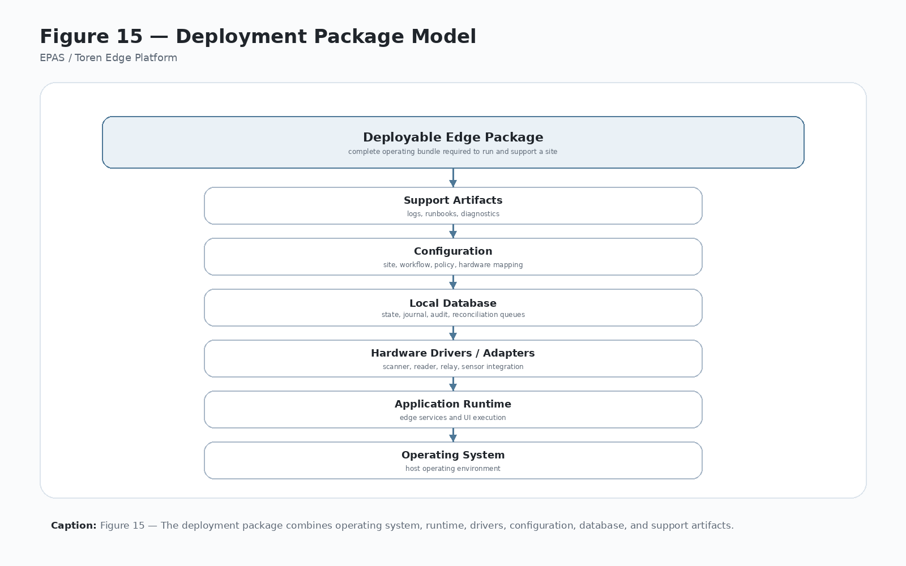

**Caption:** Figure 15 — Deployment Architecture packages the platform into repeatable field installations with supportable upgrade, rollback, diagnostics, and configuration paths.

## 15.3 Primary Responsibilities

Deployment Architecture owns:

- Deployment package structure.
- Runtime dependency definition.
- OS and device environment assumptions.
- Local database initialization expectations.
- Hardware driver and library requirements.
- Configuration file locations and defaults.
- Workflow package inclusion or retrieval.
- Certificate and secret deployment expectations.
- Upgrade and rollback model.
- Installation checklist support.
- Field diagnostic and support export expectations.
- Version traceability.

## 15.4 Deployment Concerns

A deployment must account for:

- Operating system image.
- Application runtime.
- Runtime dependencies.
- Local database initialization.
- Hardware drivers and libraries.
- Controller addressing.
- Configuration files.
- Backend endpoint settings.
- Certificate and secret handling.
- Workflow package delivery.
- Commissioning prerequisites.
- Upgrade procedure.
- Rollback strategy.
- Offline support.
- Field diagnostics.
- Support export.

## 15.5 Boundaries and Non-Responsibilities

Deployment Architecture owns how the platform gets into the field and remains supportable. It does not own live transaction execution, custody meaning, workflow semantics, hardware protocols, backend authority, or admin permissions.

Boundary examples:

- Deployment may install hardware drivers; Hardware Abstraction owns device behavior.
- Deployment may ship workflow files; Configurable Workflow Engine owns workflow meaning.
- Deployment may initialize a local database; Local Persistence owns storage mechanics.
- Deployment may install certificates; Security Architecture owns trust requirements.
- Deployment may package admin tools; Administrative Services owns admin workflows.

## 15.6 Interfaces and Collaborators

Deployment Architecture collaborates with:

- **Commissioning Technology** for identity binding after installation.
- **Local Persistence** for database initialization and migration.
- **Hardware Abstraction** for drivers and device dependencies.
- **Backend Integration** for endpoint and environment configuration.
- **Security Architecture** for certificates, secrets, and protected settings.
- **Configurable Workflow Engine** for workflow packages.
- **Administrative Services** for support tools and diagnostics.
- **Cross-Cutting Services** for logs, health checks, and support exports.

## 15.7 Data Ownership

Deployment Architecture governs deployment artifacts such as:

- Installer package manifest.
- Runtime version.
- Dependency list.
- Configuration templates.
- Workflow package version.
- Driver/library version.
- Database schema version.
- Upgrade package version.
- Rollback package version.
- Support artifact locations.

## 15.8 Operational Model

A typical deployment sequence includes:

1. Prepare hardware and OS baseline.
2. Install runtime dependencies.
3. Install application package.
4. Install drivers, libraries, and device dependencies.
5. Place default configuration and workflow package.
6. Initialize or migrate local database.
7. Install or reference certificates and protected settings.
8. Run commissioning.
9. Validate hardware and backend readiness.
10. Record deployment version and support metadata.
11. Enable runtime operation.
12. Maintain upgrade and rollback path.

## 15.9 Failure Modes

Representative failure modes include:

- Missing runtime dependency.
- Wrong OS image or architecture.
- Driver missing or incompatible.
- Configuration file missing or stale.
- Database schema mismatch.
- Certificate or secret missing.
- Backend endpoint wrong.
- Workflow package incompatible.
- Upgrade partially applies.
- Rollback unavailable.
- Field diagnostics not installed.
- Support export path missing.

Deployment failures should be discoverable during installation or commissioning, not after live transactions begin.

## 15.10 Configuration Model

Deployment configuration may include:

- Environment name.
- Backend endpoint.
- Local database location.
- Log locations.
- Workflow package reference.
- Hardware driver configuration.
- Certificate/secret references.
- Feature flags.
- Upgrade channel.
- Support export location.

## 15.11 Security and Audit Considerations

Deployment must protect sensitive configuration and preserve version traceability.

Requirements include:

- Secrets should not be exposed in plain support exports.
- Certificate handling should follow Security Architecture rules.
- Deployment version should be traceable.
- Upgrade and rollback actions should be logged.
- Field-installed configuration should be reviewable by authorized support.
- Default credentials or insecure defaults should be avoided.

## 15.12 Commercial Significance

Deployment Architecture is commercially significant because repeatable installation and upgrade processes reduce field cost and support risk. A licensable platform must be deployable by repeatable process, not by original-developer intuition.

## 15.13 IP Significance

Deployment Architecture contributes to Toren's IP position by documenting the repeatable packaging and field-deployment method for governed physical-edge execution systems.

## 15.14 Related Implementation Evidence

Candidate evidence may include:

- Installer scripts.
- Application package manifests.
- Runtime dependency list.
- Driver/DLL notes.
- Configuration templates.
- Workflow package files.
- Database initialization scripts.
- Upgrade/rollback procedures.
- Support export tools.
- Commissioning checklist.

## 15.15 Boundary Rule

Deployment Architecture owns packaging, installation, upgrade, rollback, dependency, configuration-delivery, and supportability structure. It does not own live runtime behavior, workflow meaning, custody state, hardware protocols, backend authority, or administrative permission policy.

---

# Chapter 16 — Commercial Architecture

## 16.1 Purpose

Commercial Architecture connects engineering structure to business value. EPAS is not only a technical document; it is a strategy for converting one-off engineering into reusable Toren platform capability.

Commercial Architecture is the Platform Technology that explains how platform-first engineering creates product leverage, licensee value, lower deployment cost, supportability, repeatable integrations, and defensible intellectual property.

## 16.2 Problem Addressed

Custom physical-edge systems often solve one customer problem but fail to compound value. Each deployment creates new code, new support burden, new integration assumptions, and new undocumented field knowledge.

Commercial Architecture addresses this by making reuse an architectural requirement. Each customer deployment should improve the common platform rather than become isolated custom work.

## Figure 16 — Commercial Reuse Flywheel

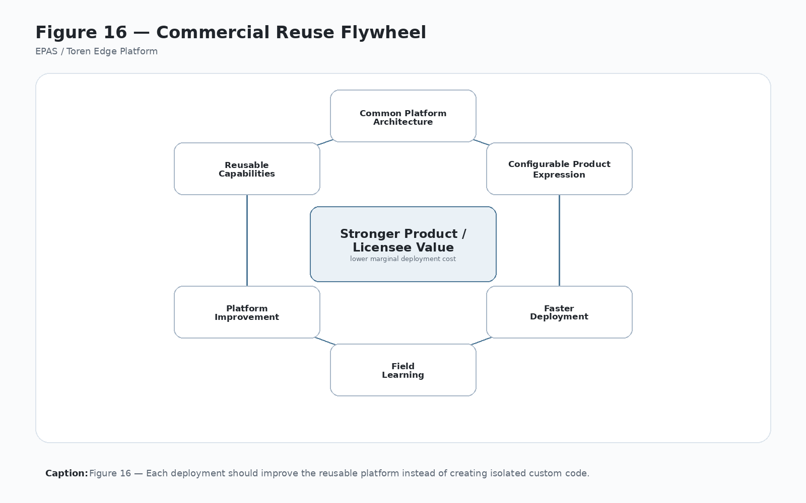

**Caption:** Figure 16 — Platform-first engineering compounds commercial value by turning deployment learning into reusable Toren platform capability.

## 16.3 Primary Responsibilities

Commercial Architecture owns the commercial interpretation of platform structure, including:

- Platform/product/deployment value separation.
- Licensee and product-family leverage.
- Deployment reuse model.
- Supportability value model.
- Repeatable integration value.
- Field-learning feedback loop.
- IP and documentation value connection.
- Customer confidence narrative.
- Cost-to-deploy reduction strategy.
- Product expansion logic.

## 16.4 Commercial Value

The platform creates value by:

- Reducing custom-code cost per deployment.
- Shortening implementation cycles.
- Improving supportability.
- Allowing customer workflows to be configured.
- Creating defensible intellectual property.
- Supporting multiple product lines from a shared architecture.
- Making integrations more repeatable.
- Increasing confidence in field operations.
- Making deployment learning reusable.
- Clarifying licensing and partner roles.

## 16.5 Boundaries and Non-Responsibilities

Commercial Architecture explains platform value but does not own implementation details.

Boundary examples:

- It explains why workflows should be configurable; the Configurable Workflow Engine owns workflow configuration.
- It explains why supportability matters; Administrative and Cross-Cutting Services implement supportability.
- It explains why IP matters; IP Strategy owns protectable concepts and evidence mapping.
- It explains why deployment repeatability matters; Deployment Architecture owns installation and upgrade model.

## 16.6 Interfaces and Collaborators

Commercial Architecture collaborates with:

- Platform Vision for company/platform/product hierarchy.
- Architectural Principles for platform-first decision rules.
- Platform Technology Architecture for taxonomy and ownership.
- Deployment Architecture for repeatability.
- Administrative Services for support value.
- Configurable Workflow Engine for customer variation.
- Backend Integration for repeatable enterprise integration.
- Intellectual Property Strategy for defensibility.
- Figure Production Notes and Canva materials for communication.

## 16.7 Operational Model

The commercial reuse model works as a cycle:

1. EPAS defines reusable architecture.
2. A product packages that architecture for a market.
3. A deployment configures it for a customer, site, workflow, and hardware set.
4. Field experience reveals needed improvements.
5. Improvements are evaluated as platform capabilities, product features, or deployment-specific work.
6. Reusable improvements return to the platform.
7. Future products and deployments become faster, safer, and more supportable.

## 16.8 Failure Modes

Representative commercial failure modes include:

- Customer-specific code forks become the norm.
- Product naming overwhelms platform identity.
- Licensee implementation redefines platform boundaries.
- Field learning is not captured.
- Support tools remain deployment-specific.
- Integrations are rewritten for each customer.
- Documentation falls behind implementation.
- IP evidence is not preserved.

## 16.9 Configuration and Packaging Model

Commercial Architecture should distinguish among:

- Toren-owned platform architecture.
- Product packaging.
- Licensee implementation.
- Customer deployment.
- Workflow configuration.
- Hardware configuration.
- Backend integration profile.
- Support and service model.

This distinction supports pricing, licensing, implementation planning, and partner communication.

## 16.10 Security and Audit Considerations

Commercial reuse must not weaken governance. Productization, licensing, and customer variation should preserve security, audit, custody, and transaction integrity requirements.

## 16.11 Commercial Principle

The platform should make the second deployment easier than the first and the tenth deployment dramatically easier than the second. **Figure 16** is the visual expression of this principle.

## 16.12 IP Significance

Commercial Architecture contributes to Toren's IP position by connecting technical architecture to business method, licensing model, documentation, repeatable implementation, and defensible platform vocabulary.

## 16.13 Related Implementation Evidence

Candidate evidence may include:

- Reusable workflow definitions.
- Repeatable deployment checklists.
- Product packaging notes.
- Customer implementation records.
- Support logs showing recurring patterns.
- Integration templates.
- Licensee or partner configuration assumptions.
- Executive and Canva presentation materials.

## 16.14 Boundary Rule

Commercial Architecture owns the business-value framing of platform reuse, product leverage, licensee scalability, field-learning capture, and commercial defensibility. It does not own technical implementation details, live runtime behavior, security policy, or legal filing strategy.

---

# Part IV — Strategic Direction

---

# Chapter 17 — Future Platform Evolution

## 17.1 Purpose

The Toren Edge Platform should evolve without losing its architectural center. Future capability should extend the platform model rather than bypass it.

Chapter 17 defines how candidate future capabilities should be evaluated, prioritized, and incorporated as reusable Platform Technologies, product features, deployment configuration, or experimental work.

## 17.2 Problem Addressed

Successful platforms attract new ideas. Some are genuine platform capabilities; others are customer requests, product features, hardware experiments, or temporary implementation needs. Without an evolution model, the platform can sprawl until its architecture becomes unclear.

Future Platform Evolution addresses this by providing a roadmap and qualification method for deciding when new capability should become part of the Toren Edge Platform.

## Figure 17 — Platform Evolution Roadmap

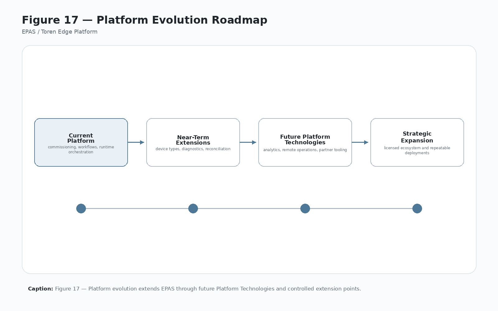

**Caption:** Figure 17 — Future evolution should extend the platform through reusable Platform Technologies and governed extension points rather than uncontrolled customization.

## 17.3 Primary Responsibilities

Future Platform Evolution owns:

- Candidate capability identification.
- Roadmap classification.
- Platform-vs-product-vs-deployment decision support.
- Evaluation of new Platform Technology candidates.
- Extension point planning.
- Roadmap communication.
- Preservation of architectural continuity.
- Feedback loop from field deployments.
- Relationship between future capability and IP strategy.

## 17.4 Candidate Evolution Areas

Future evolution may include:

- Multi-bank orchestration.
- Advanced reconciliation dashboards.
- Remote commissioning support.
- Mobile administrative tools.
- Camera-based evidence capture.
- Environmental monitoring.
- Maintenance forecasting.
- Offline-first workflow packages.
- Plugin hardware adapters.
- Expanded custody object types.
- Cloud-managed workflow versioning.
- Assisted diagnostics and support.
- Fleet health monitoring.
- Remote support workflows.
- Integration template libraries.
- Evidence package generation.

## 17.5 Qualification Model

A future capability should be considered for platform inclusion when it:

- Solves a recurring problem across deployments.
- Strengthens existing Platform Technologies.
- Has stable architectural meaning.
- Can be configured or reused.
- Improves supportability, recoverability, security, integration, or commercial value.
- Creates implementation evidence for Toren-owned capability.
- Does not undermine established responsibility boundaries.

If a capability is valuable but not reusable, it should remain product-specific or deployment-specific.

## 17.6 Near-Term Evolution

Near-term evolution should prioritize capabilities that strengthen current deployments and reduce support risk:

- Better reconciliation tooling.
- Improved admin recovery screens.
- Enhanced transaction journal visibility.
- Stronger workflow version tracking.
- Support export packages.
- Hardware diagnostics and health checks.
- Backend contract validation.

## 17.7 Mid-Term Evolution

Mid-term evolution may include capabilities that increase deployment scale:

- Multi-bank orchestration.
- Remote commissioning.
- Mobile administration.
- Configurable integration profiles.
- Advanced role and permission models.
- Camera evidence integration.
- Cloud-managed workflow packages.

## 17.8 Long-Term Evolution

Long-term evolution may include capabilities that create new product families or advanced operational intelligence:

- Assisted diagnostics.
- Maintenance forecasting.
- Fleet optimization.
- Environmental monitoring.
- Expanded custody object models.
- Plugin adapter libraries.
- Cross-site custody visibility.

## 17.9 Boundaries and Non-Responsibilities

Future Platform Evolution does not automatically approve every future idea as platform architecture. It classifies future work and protects the architecture from uncontrolled expansion.

## 17.10 Interfaces and Collaborators

Future Platform Evolution collaborates with all Platform Technologies and especially with:

- Platform Technology Architecture for taxonomy changes.
- Commercial Architecture for market and licensee value.
- IP Strategy for protectable concepts.
- Implementation Evidence Register for proof of development.
- Figure Production Notes for roadmap communication.

## 17.11 Failure Modes

Representative failure modes include:

- Feature sprawl.
- Roadmap driven only by one customer.
- New capability bypasses platform boundaries.
- Experimental work becomes production without governance.
- Product feature mislabeled as platform technology.
- Useful field learning not captured.
- Roadmap not tied to implementation evidence.

## 17.12 Security and Audit Considerations

Future capabilities should not weaken security, custody governance, transaction integrity, or audit evidence. New physical actions, remote support functions, camera evidence, diagnostics, or cloud-managed configuration must preserve trust boundaries.

## 17.13 Commercial Significance

Future Platform Evolution is commercially significant because it helps Toren prioritize capabilities that compound platform value rather than scatter engineering effort.

## 17.14 IP Significance

Future Platform Evolution supports IP strategy by identifying emerging protectable methods, patterns, and platform technologies before they are lost as undocumented implementation work.

## 17.15 Related Implementation Evidence

Candidate evidence may include:

- Roadmap notes.
- Prototype branches.
- Feature flags.
- Experimental adapter interfaces.
- Customer deployment lessons.
- Support incident patterns.
- Reconciliation needs.
- Diagnostic experiments.
- New workflow families.

## 17.16 Evolution Principle

New capabilities should become Platform Technologies when they represent reusable architectural responsibility rather than one-customer customization. Candidate Platform Technologies should be evaluated against the roadmap in **Figure 17** and the qualification criteria in Chapter 3.

---

# Chapter 18 — Intellectual Property Strategy

## 18.1 Purpose

EPAS documents the architecture, vocabulary, boundaries, operating principles, implementation evidence, and commercial framing that make the Toren Edge Platform distinct. This supports engineering clarity, onboarding, customer communication, partner communication, licensing, and intellectual-property development.

Chapter 18 does not provide legal advice or replace counsel review. It organizes the technical and commercial material that may support future patent, trade secret, copyright, licensing, and documentation strategies.

## 18.2 Problem Addressed

Engineering work loses strategic value when it is undocumented, inconsistently named, or trapped inside one implementation. A working system may contain protectable architecture, but if its methods, vocabulary, boundaries, diagrams, and evidence are not captured, the commercial and legal position weakens.

IP Strategy addresses this by connecting platform concepts to implementation evidence and reusable documentation.

## Figure 18 — IP Strategy Map

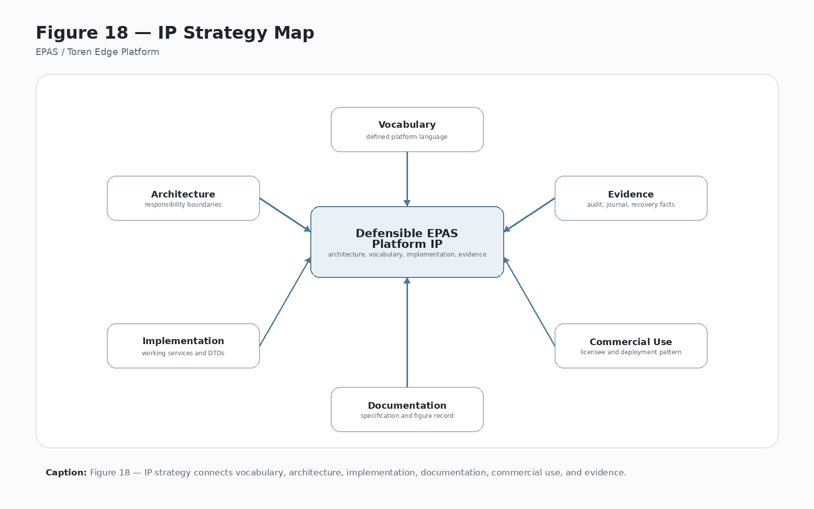

**Caption:** Figure 18 — EPAS supports intellectual property strategy by connecting architecture, vocabulary, implementation evidence, and commercial expression.

## 18.3 Primary Responsibilities

IP Strategy owns the documentation framework for:

- Stable platform vocabulary.
- Potentially protectable concepts.
- Evidence mapping.
- Platform Technology boundaries.
- Commercial defensibility.
- Trade secret candidates.
- Patent discussion candidates.
- Copyrighted documentation and diagrams.
- Licensee and product-language consistency.
- Future legal-review packages.

## 18.4 Protectable Concepts

Potentially protectable or commercially defensible concepts include:

- Governed physical-edge transaction orchestration.
- Configurable custody workflows.
- Local-first transaction journaling for physical action recovery.
- Separation of enterprise authority and edge execution.
- Hardware-abstracted compartment control.
- Reconciliation between local physical truth and enterprise records.
- Commissioning models for identity-bound edge nodes.
- Platform Technology responsibility taxonomy.
- Configurable workflow action semantics.
- ACK/reconciliation handling after local physical action.
- Administrative recovery without governance bypass.
- Platform/product/deployment hierarchy for physical-edge systems.

## 18.5 Evidence Model

Potential IP claims or defensible trade-secret positions should be supported by evidence such as:

- Architecture specification text.
- Diagrams and figure captions.
- Workflow configuration records.
- Runtime transaction traces.
- Transaction journal schema and state transitions.
- Backend request/response DTOs.
- Reconciliation records.
- Commissioning artifacts.
- Hardware abstraction interfaces.
- Administrative recovery logs.
- Customer deployment lessons.
- Version history and commit history.

## 18.6 Boundaries and Non-Responsibilities

IP Strategy organizes technical evidence and strategic vocabulary. It does not determine legal filing scope, patentability, ownership disputes, trademark clearance, or licensing terms without attorney review.

## 18.7 Interfaces and Collaborators

IP Strategy collaborates with:

- Document Control for authoritative manuscript governance.
- Chapter 1 for Toren/EPAS/product/deployment naming.
- Chapter 3 for Platform Technology taxonomy.
- Appendix F for implementation evidence.
- Figure Production Notes for diagram traceability.
- Commercial Architecture for licensing and reuse framing.
- GitHub history for documented development evidence.
- Canva materials for executive communication and visual summaries.

## 18.8 Operational Model

A practical IP-development workflow includes:

1. Identify a platform concept.
2. Confirm its authoritative definition in EPAS.
3. Locate implementation evidence.
4. Map related figures and glossary terms.
5. Determine whether the concept is architecture, method, configuration, trade secret, documentation, or commercial process.
6. Prepare a concise legal-review note.
7. Preserve version history and evidence references.
8. Keep downstream materials consistent with the master terminology.

## 18.9 Failure Modes

Representative IP-strategy failure modes include:

- Inconsistent naming across documents.
- Product name used as platform identity.
- Implementation evidence not preserved.
- Concepts described only in code comments.
- Diagrams not traceable to manuscript figures.
- Customer-specific work confused with platform-owned architecture.
- Legal-review material disconnected from implementation evidence.
- Trade secret information published unintentionally.

## 18.10 Security and Confidentiality Considerations

IP Strategy must distinguish between public-facing explanation and confidential implementation detail. Some EPAS-derived materials may be suitable for customers or partners; others may need to remain internal or counsel-reviewed.

## 18.11 Commercial Significance

IP Strategy is commercially significant because it increases the value of the platform beyond a single product. Clear vocabulary, documented methods, and implementation evidence strengthen licensing, partnership, investor, and customer communication.

## 18.12 Related Implementation Evidence

Candidate evidence may include:

- GitHub commit history.
- Source code implementing Platform Technologies.
- Workflow configuration files.
- DTOs and API contracts.
- Database schemas.
- Transaction journals.
- Reconciliation logs.
- Commissioning records.
- Administrative recovery tools.
- Diagrams and Canva artifacts.

## 18.13 IP Principle

The platform should be described consistently. Consistent vocabulary supports patents, trade secrets, customer proposals, training materials, and engineering execution. **Figure 18** should be used when converting EPAS into legal, commercial, or investor-facing materials.

## 18.14 Boundary Rule

IP Strategy owns the documentation, vocabulary, evidence-mapping, and strategic framing needed to support intellectual-property development. It does not replace legal advice, formal patent analysis, trademark clearance, or contract drafting.

---

# Chapter 19 — Conclusions and Strategic Vision

## 19.1 Strategic Conclusion

The Toren Edge Platform is a governed execution architecture for physical operations at the edge. It treats locker control, asset custody, package movement, credential validation, workflow execution, transaction journaling, hardware abstraction, local persistence, backend acknowledgement, administrative recovery, and reconciliation as parts of one coherent system.

EPAS exists because physical-edge execution is not a simple extension of cloud software. Physical action happens locally. Doors open locally. Devices are released locally. Assets are staged locally. Operators need immediate local feedback. When those local actions occur, the platform must preserve enough truth to explain, recover, acknowledge, and reconcile them.

## 19.2 What EPAS Establishes

EPAS establishes:

- Toren as the company, platform owner, and licensor.
- EPAS as the reference architecture for the Toren Edge Platform.
- A platform-first distinction among platform, product, licensee, and deployment.
- A set of governing architectural principles.
- A Platform Technology taxonomy.
- A standard chapter pattern for expanding each Platform Technology.
- A transaction lifecycle for governed physical-edge execution.
- A custody model for controlled objects and compartments.
- A local-first transaction integrity model.
- A backend integration contract model.
- A commercial reuse and IP strategy foundation.

## Figure 19 — EPAS Strategic Summary

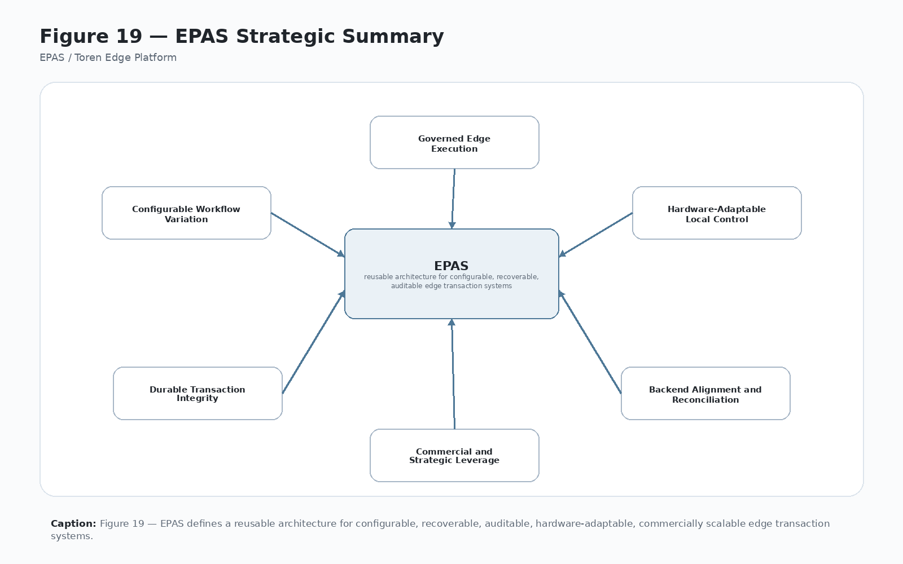

**Caption:** Figure 19 — EPAS defines a reusable architecture for governed physical-edge execution, commercial platform reuse, and defensible technology development.

## 19.3 Strategic Value

The strategic value of EPAS is that it turns a working implementation into a repeatable platform. It makes the architecture explainable to engineers, customers, partners, executives, licensees, and future investors. It also creates a foundation for product expansion beyond any single locker deployment.

The platform creates leverage when:

- new workflows are configured rather than hardcoded,
- new hardware is adapted rather than embedded into workflow logic,
- new deployments reuse commissioning and deployment patterns,
- support teams diagnose with shared evidence,
- backend integrations follow explicit contracts,
- failed transactions become recoverable rather than mysterious,
- and customer-specific learning improves the common platform.

## 19.4 Platform Success Criteria

The platform succeeds when field operations become boring in the best possible way: predictable, auditable, recoverable, supportable, and repeatable.

Success should be measured by:

- reduced custom code per deployment,
- faster commissioning,
- fewer unresolved support events,
- clearer transaction evidence,
- more reusable workflow configuration,
- better hardware flexibility,
- stronger backend contract consistency,
- cleaner administrative recovery,
- and more defensible platform vocabulary.

## 19.5 Remaining Work

The manuscript should continue toward publication by:

- completing technical continuity checks across all chapters,
- expanding the implementation evidence register,
- producing finished figures from the figure placeholders,
- updating the master manuscript from the chapter files,
- creating an executive Canva deck,
- creating a legal/IP working summary,
- and preparing a publication-ready PDF or document edition.

## 19.6 Closing Statement

EPAS defines the Toren Edge Platform as a governed architecture for physical-edge systems. Its importance is not limited to opening compartments or validating assets. Its importance is that it defines a repeatable way to connect business authority, local physical execution, durable transaction evidence, custody governance, backend acknowledgement, and commercial reuse.

That is the strategic center of the platform: governed physical action with durable operational truth.

---

# Appendices

---

# Appendix A — Platform Technology Responsibility Matrix

## A.1 Purpose

This appendix provides a consolidated responsibility matrix for the Toren Edge Platform. It is intended to help engineers, support personnel, commercial stakeholders, licensees, and documentation reviewers understand which Platform Technology owns each major responsibility and which responsibilities must remain outside that technology.

The matrix should be used during design review, implementation review, chapter editing, support analysis, and future platform planning.

## A.2 Core Responsibility Matrix

| Platform Technology | Primary Responsibility | Must Not Own | Primary Figure |
| --- | --- | --- | --- |
| Commissioning Technology | Site, kiosk, locker bank, controller, hardware topology, initial identity, and initial local state | Runtime custody decisions or live transaction recovery | Figure 4 |
| Configurable Workflow Engine | Workflow definition, workflow identity, workflow action, configuration-driven step progression | Hardware device implementation or backend business authority | Figure 5 |
| Runtime Orchestration | Coordinated execution of governed transactions | Enterprise business record ownership or low-level hardware protocols | Figure 6 |
| Custody Governance | Custody state vocabulary, valid transitions, compartment/object custody meaning | Relay-board protocols or API transport | Figure 7 |
| Transaction Integrity | Durable journal, transaction states, ACK status, recovery and reconciliation evidence | Customer-specific screen layout or business eligibility | Figure 8 |
| Hardware Abstraction | Device communication, command translation, hardware health, and physical event reporting | Business authorization or custody semantics | Figure 9 |
| Local Persistence | Durable local storage and local operational memory | Business meaning of every stored value or cloud source-of-truth policy | Figure 10 |
| Backend Integration | API contracts, enterprise communication, validation, authorization, ACK, reconciliation transport | UI rendering or local physical truth | Figure 11 |
| Cross-Cutting Services | Logging, tracing, diagnostics, correlation, time, serialization, health, support export | Workflow-specific business meaning or custody semantics | Figure 12 |
| Security Architecture | Identity, authority, permissions, secrets, trust boundaries, protected configuration | Locker assignment algorithms or workflow step progression | Figure 13 |
| Administrative Services | Governed support, diagnostics, manual tests, recovery, reconciliation, controlled override | Unlogged operational bypass or ownership of underlying state meaning | Figure 14 |
| Deployment Architecture | Installation, packaging, dependencies, upgrade, rollback, configuration delivery | Product strategy or live runtime behavior | Figure 15 |
| Commercial Architecture | Platform reuse, product/licensee/deployment value, commercial leverage | Low-level runtime implementation or legal filing decisions | Figure 16 |

## A.3 Review Rule

When a proposed feature, bug fix, customer request, or implementation change touches more than one Platform Technology, the design should identify:

1. Primary owner.
2. Supporting collaborators.
3. Data owner.
4. Failure owner.
5. Audit/evidence owner.
6. Commercial or IP relevance.

No implementation should quietly move responsibility into a screen, DTO, database table, or adapter simply because that is where the immediate code change is easiest.

## A.4 Responsibility Leakage Signals

Common signs of responsibility leakage include:

- UI code deciding custody state.
- Hardware adapters deciding business eligibility.
- Backend DTOs defining local physical truth.
- Database tables becoming the only description of platform meaning.
- Administrative tools changing state without audit evidence.
- Workflow configuration bypassing security requirements.
- Runtime orchestration absorbing all platform responsibilities.
- Product-specific naming redefining platform architecture.

## A.5 Use in Future Editing

Each chapter expansion should be checked against this matrix. If a later chapter introduces a new responsibility that does not fit the matrix, either the chapter should be corrected or the Platform Technology taxonomy in Chapter 3 should be deliberately revised.

---

# Appendix B — Core Architectural Principles

## B.1 Purpose

This appendix provides a compact reference for the core architectural principles governing EPAS and the Toren Edge Platform. Chapter 2 remains the authoritative expanded discussion. This appendix is intended as a quick checklist for design review, implementation review, support review, and future editing.

## B.2 Principle List

1. **Single Ownership** — Every significant engineering responsibility has one architectural owner.
2. **Separation of Responsibilities** — Major platform responsibilities remain separated so one layer does not absorb the whole system.
3. **Configuration Before Customization** — Deployment variation should be expressed through governed configuration before source-code customization.
4. **Deterministic Execution** — The same operational inputs should produce the same platform behavior unless a documented exception applies.
5. **Operational Trust** — The edge platform must preserve trustworthy local state when networks, devices, or workflows fail.
6. **Platform Before Product** — Products, licensees, and customer deployments express the platform; they do not define it.
7. **No Physical Action Without Transaction Context** — Governed physical-edge actions must be tied to explicit transaction context.
8. **Local Truth Must Be Durable** — The edge node must preserve durable evidence of local events.
9. **Backend Authority Must Be Explicit** — Backend calls must carry explicit identity, workflow, actor, request, and correlation context.
10. **Administrative Actions Must Be Governed** — Manual tests, overrides, recovery, reconciliation, and correction must be permissioned, logged, and explainable.

## B.3 Design Review Questions

Use these questions when reviewing changes:

- Which Platform Technology owns this responsibility?
- Is this behavior configured before it is customized?
- Does this change preserve transaction context?
- Does local truth remain durable after failure?
- Are backend assumptions explicit?
- Are administrative actions governed?
- Does the change strengthen the platform rather than create isolated product code?

## B.4 Editing Rule

When expanding any chapter, use these principles as the guardrails. Later chapters may apply the principles, but they should not redefine them.

---

# Appendix C — Glossary

## C.1 Purpose

This glossary defines the core vocabulary used across EPAS. These terms should be used consistently in the master manuscript, chapter files, diagrams, executive summaries, Canva materials, implementation tickets, and future legal or commercial summaries.

## C.2 Terms

**ACK** — Acknowledgement sent from the edge platform to backend services indicating the result of a governed transaction.

**Actor** — A person, service, or system identity performing an action.

**Administrative Services** — Platform Technology providing governed support, diagnostics, manual tests, recovery, reconciliation, and administrative review.

**API** — Application programming interface used for explicit edge-to-backend communication, including validation, authorization, acknowledgement, reconciliation, configuration sync, and audit exchange.

**Backend Integration** — Platform Technology responsible for API contracts, validation, authorization, ACK, reconciliation, configuration sync, and enterprise communication.

**Commissioning** — The process of assigning identity, configuration, hardware mapping, and initial state to an edge node.

**Configurable Workflow Engine** — Platform Technology that expresses deployment-specific behavior through workflow configuration rather than source-code customization.

**Correlation ID** — Identifier used to trace related activity across runtime, backend calls, logs, journal entries, and audit records.

**Cross-Cutting Services** — Shared platform services such as logging, diagnostics, correlation, health checks, time services, serialization support, and support export.

**Custody** — Governed responsibility for an asset, package, device, or compartment state.

**Custody Governance** — Platform Technology defining custody states, valid transitions, exception meaning, and relationship between custody objects and physical locations.

**Deployment** — A configured instance of a product or licensed implementation for a customer, site, workflow, hardware set, and operating policy.

**Deployment Architecture** — Platform Technology defining installation, packaging, configuration delivery, upgrade, rollback, dependency, and supportability structure.

**Diagram Placeholder** — A manuscript note defining the intent, content, and caption for a future professional figure.

**DTO** — Data transfer object used to carry structured request, response, acknowledgement, or reconciliation data across service boundaries.

**Edge Node** — A deployed kiosk, locker bank controller, or other field system executing physical operations.

**EPAS** — Edge Platform Architecture Specification; the reference architecture for the Toren Edge Platform.

**Figure Register** — The numbered list of figures used to coordinate manuscript text, diagram production, Canva design work, and final publication layout.

**Hardware Abstraction** — Platform layer that isolates device-specific communication from workflow and business logic.

**ID** — Identifier. Use uppercase ID in formal EPAS terminology, for example Actor ID, Request ID, Transaction ID, Correlation ID, Kiosk ID, and Locker Bank ID.

**IP** — Intellectual property. Use uppercase IP when referring to intellectual-property strategy, evidence, defensibility, or review.

**Licensee** — A company or business entity authorized to implement, commercialize, manufacture, sell, operate, or distribute a product or deployment based on EPAS.

**Local Persistence** — Platform Technology providing durable local operational memory for configuration, state, journal records, diagnostics, and reconciliation.

**Locker Bank** — A physical group of controlled compartments governed by the platform.

**Operational Trust** — The ability to explain and recover the truth of physical operations even when networks, devices, or workflows fail.

**Platform Technology** — A durable architectural responsibility within the Edge Platform.

**Product** — A packaged or branded expression of the Toren Edge Platform.

**Reconciliation** — The process of resolving differences between local physical-edge records and backend enterprise records.

**Runtime Orchestration** — Platform Technology coordinating configured workflow intent, validation, authorization, custody, hardware action, local state, ACK, and reconciliation.

**Security Architecture** — Platform Technology defining trust boundaries, identity, authority, permissions, protected configuration, and sensitive-data requirements.

**Toren** — The company, platform owner, and licensor associated with the Toren Edge Platform.

**Toren Edge Platform** — The platform governed by EPAS for configurable, recoverable, auditable, hardware-adaptable physical-edge transaction execution.

**Transaction Integrity** — Platform Technology providing durable journal state, recovery classification, ACK status, retry state, and reconciliation visibility.

**Transaction Journal** — Durable local record of transaction progress used for recovery, audit, and reconciliation.

**Workflow Action** — The operational intent of a workflow, such as pickup, stage, checkout, return, deposit, release, retrieve, exchange, or inspect.

**Workflow Key** — A stable configured identifier for a workflow definition.

## C.3 Naming Rule

Toren is the platform owner and licensor. EPAS is the reference architecture. Products, licensees, customer deployments, and manufactured systems may express the platform, but they should not redefine the platform vocabulary.

---

# Appendix D — Figure Production Notes

## D.1 Purpose

The figures in EPAS are intentionally defined as numbered placeholders before final artwork is produced. This allows architecture, captions, cross-references, and publication structure to stabilize before time is spent on finished graphics.

The figure set should support three audiences:

- engineering teams that need responsibility clarity,
- commercial and executive audiences that need the platform argument,
- and legal/IP review that needs stable vocabulary and evidence mapping.

## D.2 Figure Development Sequence

Recommended figure production order:

1. **Figure 1 — Edge Platform Context Model** because it frames the entire EPAS argument.
2. **Figure 3 — Platform Technology Map** because it becomes the core architecture overview.
3. **Figure 6 — Runtime Transaction Lifecycle** because it explains how the platform operates.
4. **Figure 8 — Transaction Journal and Recovery Model** because it defends operational trust.
5. **Figure 11 — Edge-to-Backend Responsibility Split** because it clarifies authority and execution.
6. **Figure 16 — Commercial Reuse Flywheel** because it turns architecture into business value.
7. **Figure 19 — EPAS Strategic Summary** because it becomes the executive closing graphic.
8. **Figure 2 — Platform / Product / Deployment Hierarchy** because it supports naming, licensing, and commercial clarity.
9. **Figure 7 — Custody State Model** because it supports the operational trust story.
10. Remaining Platform Technology figures should follow after the core narrative is stable.

## D.3 Canva Deck Alignment

The first Canva executive deck should reuse a smaller subset of the figure register:

- Figure 1 as the opening context slide.
- Figure 2 as the platform/product/deployment explanation.
- Figure 3 as the architecture overview.
- Figure 6 as the runtime explanation.
- Figure 8 as the operational-trust proof point.
- Figure 11 as the backend/edge split.
- Figure 16 as the commercial argument.
- Figure 19 as the closing summary.

## D.4 Figure Style Guidance

Figures should be:

- clean enough for executive review,
- precise enough for engineering review,
- visually consistent across the deck and manuscript,
- traceable to figure numbers and captions,
- and free of product-specific naming unless deliberately required.

Recommended visual conventions:

- Use Toren / EPAS / Edge Platform terminology for platform-level diagrams.
- Use products, licensees, and deployments only as lower-level examples.
- Use consistent colors, iconography, and boundary boxes.
- Highlight responsibility boundaries rather than decorative detail.
- Avoid diagrams that imply the backend owns local physical truth.

## D.5 Publication Rule

Each finished figure should keep the figure number and caption from this manuscript unless the manuscript is deliberately renumbered. Canva graphics, Word/PDF editions, executive briefs, and presentation decks should use the same figure numbers wherever practical to preserve traceability.

## D.6 Figure Review Checklist

Before a figure is finalized, verify:

- It uses the correct figure number.
- It matches the manuscript caption.
- It uses Toren/EPAS naming correctly.
- It does not redefine a Platform Technology incorrectly.
- It shows responsibility boundaries clearly.
- It can be reused in a Canva deck or publication document.
- It does not expose confidential implementation detail unless intended for internal use.

---

# Appendix E — Chapter Specification Pattern

## E.1 Purpose

This appendix defines the standard expansion pattern for EPAS Platform Technology chapters. The pattern keeps the manuscript consistent as individual chapters are expanded, reviewed, and later assembled into a publication-ready master document.

## E.2 Standard Pattern

Use this pattern when expanding any Platform Technology chapter:

1. **Purpose** — Why the technology exists.
2. **Problem Addressed** — What operational or commercial problem the technology solves.
3. **Primary Responsibilities** — What the technology owns.
4. **Boundaries and Non-Responsibilities** — What the technology must not own.
5. **Interfaces and Collaborators** — Which other technologies it depends on or serves.
6. **Data Ownership** — Which records, identifiers, states, or schemas it creates or governs.
7. **Operational Model** — How it behaves during normal execution.
8. **Failure Modes** — How it behaves when validation, hardware, storage, network, device, or operator behavior fails.
9. **Configuration Model** — Which behavior should be configurable.
10. **Security and Audit Considerations** — What must be protected, logged, permissioned, redacted, or reviewed.
11. **Commercial Significance** — How it improves reuse, supportability, deployment speed, customer value, or licensee scalability.
12. **IP Significance** — How it contributes to protectable vocabulary, architecture, method, diagrams, or implementation evidence.
13. **Related Implementation Evidence** — Code, DTOs, logs, database tables, services, workflows, configuration files, or support artifacts that prove the concept exists.
14. **Related Figures** — Figures that explain or summarize the technology. The chapter's primary figure header satisfies this requirement unless the chapter references additional figures that need to be listed separately.
15. **Boundary Rule** — A final compact statement of what the technology owns and must not absorb.

## E.3 Editing Guidance

When expanding a chapter:

- Preserve the chapter’s primary ownership.
- Do not redefine terms owned by another chapter.
- Reference collaborators rather than absorbing their responsibilities.
- Keep Toren/EPAS naming consistent.
- Use product-specific examples only when needed for implementation evidence.
- Preserve figure numbering and captions.
- Add implementation evidence candidates when they help prove the architecture.

## E.4 Continuity Checklist

Before a chapter expansion is considered complete, verify:

- The chapter has a clear owner.
- The chapter says what it does not own.
- Collaborators are named consistently.
- Data ownership is not confused with storage ownership.
- Failure modes are explicit.
- Security and audit implications are included.
- Commercial and IP significance are included.
- The chapter's primary figure header is present, and any additional related figures are listed where needed.
- The final Boundary Rule is present.

## E.5 Assembly Rule

When the manuscript is reassembled from chapter files, this appendix should be used to identify chapters that are incomplete, inconsistent, missing a primary figure reference, or missing the final boundary rule.

---

# Appendix F — Implementation Evidence Register

## F.1 Purpose

This appendix is a working register for connecting EPAS architecture to implementation evidence. It should be expanded as the codebase, logs, configuration files, deployment artifacts, diagrams, and customer implementation records mature.

The register helps convert architecture from description into defensible evidence. It supports engineering review, customer communication, support readiness, commercial reuse, and future IP strategy.

## F.2 Evidence Register

| Evidence Area | Candidate Implementation Evidence | EPAS Relevance |
| --- | --- | --- |
| Naming and ownership | Document control, naming rule, glossary, platform/product/deployment language, `EdgePlatformArchitectureSpecification-v1.9.md` | Supports Toren ownership and EPAS reference-architecture clarity. |
| Platform technology taxonomy | Responsibility matrix, chapter boundaries, Platform Technology definitions, `appendices/appendix-a-platform-technology-responsibility-matrix.md` | Supports platform-first architecture and responsibility ownership. |
| Commissioning | Commissioning screens, kiosk identity records, locker bank identity, controller branch mapping, initial status records, commissioning ID flow, controller port A/B setup | Supports identity-bound edge-node setup and repeatable deployment readiness. |
| Workflow configuration | Workflow definition JSON, workflow keys, workflow actions, validation profiles, enabled workflow lists, `KioskWorkflowConfiguration`, `WorkflowDefinition`, `DefaultWorkflowKey`, `EnabledWorkflows`, `ScanValidationProfiles` | Supports configuration-before-customization and workflow versioning. |
| Runtime orchestration | Transaction execution services, screen progression, validation/authorization sequence, assignment flow, runtime context carrying workflow key/action, compartment assignment service | Supports governed physical-edge execution. |
| Custody governance | Locker status records, asset status transitions, compartment state, defect handling, reservation records, `LockerStatus`, current asset/package references, defect option handling | Supports custody-state model and reconciliation. |
| Transaction integrity | Transaction journal table, transaction state enum, recovery service, ACK retry records, `LockerTransactionJournal`, `LockerTransactionRecoveryService`, ACK-pending/ACK-failed records | Supports local-first recovery and operational trust. |
| Hardware abstraction | Scanner service, reader adapter, locker controller service, controller branch mapping, hardware diagnostic logs, `BarcodeScanService`, credential reader adapters, `LockerControllerService`, controller branch A/B mapping | Supports hardware independence and adapter principle. |
| Local persistence | SQLite schema, configuration records, locker bank records, journal records, reconciliation queue, `Locker`, `LockerStatus`, local configuration tables, local database initialization | Supports durable local operational memory. |
| Backend integration | Validate, authorize, ACK, reconcile DTOs and service methods, request/correlation IDs, `AssetValidateRequest`, `LockerAuthorizeRequestDto`, `LockerAckRequestDto`, backend service calls | Supports explicit edge-to-backend contract. |
| Cross-cutting services | Structured logs, audit logs, error classification, health checks, support exports, `FileAuditLogger`, correlation ID traces, diagnostic exports | Supports traceability and supportability. |
| Security architecture | Actor validation, role/permission records, kiosk identity, API credentials, protected configuration, actor ID propagation, API authentication settings | Supports trust boundaries and permissioned physical action. |
| Administrative services | Admin diagnostics, locker status review, controller tests, recovery tools, reconciliation actions, admin incomplete transaction review, manual compartment test, out-of-service actions | Supports governed support and recovery. |
| Deployment architecture | Installer package, app settings, runtime dependencies, hardware drivers, support export, rollback notes, application runtime, driver/DLL dependencies, SQLite database location | Supports repeatable deployment and supportability. |
| Commercial architecture | Reuse examples, deployment learning, product packaging, licensee assumptions, customer proposals, executive briefing language, Canva deck alignment | Supports commercial platform leverage. |
| Future evolution | Roadmap notes, prototypes, feature flags, support incident patterns, candidate Platform Technology notes, remote commissioning concepts, advanced reconciliation concepts | Supports deliberate platform evolution. |
| IP strategy | GitHub history, diagrams, glossary, implementation evidence, chapter revisions, legal-review notes, `EPAS-Continuity-Review-v1.9.md`, figure placeholders, Canva artifacts | Supports defensible platform vocabulary and future IP work. |

## F.3 Concrete Evidence Anchors

The following implementation anchors should be used when assembling legal-review notes, engineering proof summaries, customer technical appendices, or future publication evidence tables. Names may be refined as the implementation repository is reviewed in detail.

| Anchor | Evidence Type | Relevant EPAS Area |
| --- | --- | --- |
| `KioskWorkflowConfiguration` | Workflow configuration object | Configurable Workflow Engine |
| `WorkflowDefinition` | Workflow definition object | Configurable Workflow Engine |
| `DefaultWorkflowKey` / `HomePickupWorkflowKey` / `HomeDeliveryWorkflowKey` | Workflow selection settings | Configurable Workflow Engine |
| `EnabledWorkflows` | Workflow enablement list | Configurable Workflow Engine / Administration |
| `ScanValidationProfiles` | Validation profile configuration | Workflow / Backend Integration |
| `AssetValidateRequest` | Backend validation DTO | Backend Integration |
| `LockerAuthorizeRequestDto` | Backend authorization DTO | Backend Integration |
| `LockerAckRequestDto` | Backend acknowledgement DTO | Backend Integration / Transaction Integrity |
| `LockerTransactionJournal` | Durable transaction journal table | Transaction Integrity / Local Persistence |
| `LockerTransactionRecoveryService` | Startup/incomplete transaction recovery service | Transaction Integrity / Administrative Services |
| `LockerActionService` | Runtime action coordination service | Runtime Orchestration |
| `LockerControllerService` | Hardware control service | Hardware Abstraction |
| `BarcodeScanService` | Scanner input service | Hardware Abstraction / Workflow |
| `FileAuditLogger` | File-based audit evidence | Cross-Cutting Services / Audit |
| `Locker` table | Local compartment or locker identity records | Local Persistence / Commissioning |
| `LockerStatus` table | Local compartment or locker state records | Local Persistence / Custody Governance |
| Controller branch A/B mapping | Hardware topology configuration | Commissioning / Hardware Abstraction |
| Admin locker status review | Administrative diagnostic view | Administrative Services |
| Manual compartment/controller test | Administrative hardware diagnostic action | Administrative Services / Hardware Abstraction |
| ACK retry/reconciliation records | Recovery and backend alignment evidence | Transaction Integrity / Backend Integration |

## F.4 Evidence Quality Levels

Evidence can be classified by maturity:

- **Observed** — The behavior or artifact exists in a working implementation.
- **Documented** — The behavior or artifact is described in EPAS, tickets, code comments, or support notes.
- **Validated** — The behavior or artifact has been tested, reviewed, or demonstrated.
- **Deployed** — The behavior or artifact is present in a customer or field deployment.
- **Reusable** — The behavior or artifact is structured for platform reuse beyond one deployment.

## F.5 Evidence Capture Rule

When a chapter is expanded or a major implementation feature is completed, Appendix F should be updated with evidence references. Evidence should include file names, service names, DTOs, database tables, logs, configuration records, or deployment artifacts wherever practical.

## F.6 Evidence Review Checklist

For each evidence item, ask:

- Which Platform Technology does it support?
- Does it prove architecture or only implementation detail?
- Is it reusable across deployments?
- Does it support operational trust, custody, transaction integrity, or backend authority?
- Is it safe to share externally, or should it remain internal?
- Does it support commercial or IP positioning?

## F.7 Future Expansion

Future versions of this appendix should include direct references to repository paths, DTO names, service names, database tables, figure numbers, support logs, and customer deployment evidence. The next evidence pass should inspect the implementation repository and replace candidate anchor names with verified file paths and line references where practical.
